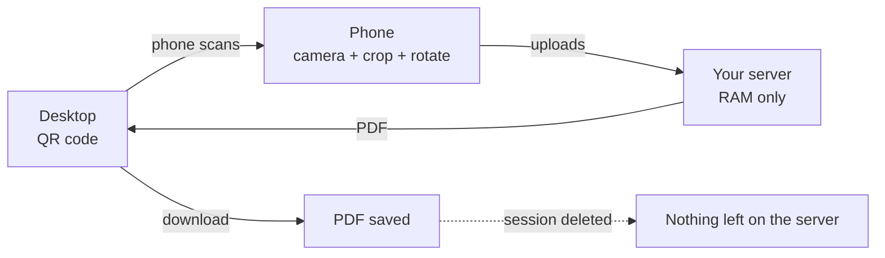

# DocFlow - Document Scanner

[](LICENSE)
[](https://golang.org)
[](https://vuejs.org)
[](.github/workflows/ci.yml)
[](docs/release-plan.md)

**Scan documents with your phone, download a PDF on your desktop - without
any cloud.** DocFlow is a self-hosted document scanner for your own
hardware: the desktop shows a QR code, the phone scans it, photographs the
documents page by page, and the server assembles a multi-page PDF - in
seconds, on your own machine.

Your documents never leave your network. Nothing is stored on disk, no
account is needed, and everything is wiped from memory the moment you
download the PDF.

<!-- Screenshots: drop files into docs/img/ and adjust paths
<p align="center">
  
  &nbsp;
  
</p>
-->

## Why DocFlow?

Mobile scanner apps send your documents to cloud servers you don't control.
DocFlow flips the model:

- **Your hardware, your data** - runs on a Raspberry Pi, a NAS, or any
  machine you control; documents exist only in RAM and are deleted the
  moment the PDF is downloaded (burn-after-reading)
- **No accounts, no apps** - the phone needs only a browser; connection is
  one QR scan plus a 6-digit PIN
- **Zero cloud, zero telemetry** - no external resources are loaded,
  nothing is tracked, nothing leaves your network (unless you decide to
  host it publicly)
- **Ready in minutes** - a single binary (or one `docker run`) and you
  have a working scanner station

Typical uses: digitizing receipts, contracts, and letters at home;
a shared scan station for a small office; an air-gapped document workflow
that must never touch a third-party cloud.

## How it works



1. **Desktop:** open `https://<server>:8082` - a QR code and PIN appear
2. **Phone:** scan, enter the PIN, take photos (rotate/crop as needed)
3. **Desktop:** download the finished PDF - the session is deleted
   automatically

## Features

- **Session Management** - Temporary sessions with 6-digit PIN and configurable timeout
- **QR Code Connection** - Automatic LAN IP detection (public URL override for containers/proxies)
- **Multi-Page Upload** - Multiple photos per session, editable (rotate, crop)
- **Camera Angle Indicator** - Sensor-based tilt hint with visual frame-analysis fallback that works in every browser
- **PDF Conversion** - Server-side multi-page PDF with JPEG compression (85%)
- **Real-Time Updates** - WebSocket communication between desktop and mobile (PIN auth via first message, never in URLs)
- **Burn-after-Reading** - Session is deleted after PDF download
- **Dark Mode** - Follows the system preference automatically
- **Multilingual** - German and English UI, chosen from the browser language
- **HTTPS** - Runtime-generated self-signed TLS certificate (or own certs via config)
- **Privacy by Design** - RAM-only processing, no IP/PIN logging, configurable deployment

## Tech Stack

| Layer | Technology |
|-------|------------|
| Backend | Go 1.26 / Gin / gorilla/websocket / go-pdf/fpdf |
| Frontend | Vue 3 / Vite / Pinia / vue-i18n / Vitest |
| Configuration | Viper (YAML + ENV + CLI Flags) |
| Logging | log/slog (JSON, stdlib) |

## Quick Start

### Single binary (recommended)

```bash
# From project root: builds frontend, embeds it, compiles everything
make release

# Start server
cd backend && ./docflow
```

Open `https://localhost:8082` - done.

### Docker

```bash
docker build -t docflow .
docker run -p 8082:8082 \
  -e DSCAN_SERVER_PUBLIC_URL=https://<server-ip>:8082 \
  docflow
```

### Development

```bash
# Backend
cd backend
make build       # Build binary
make run         # Start HTTPS server on port 8082

# Frontend (development)
cd frontend/dokumentenscanner
npm install
npm run dev      # Dev server with hot reload
```

## Build & Deploy

Cross-compile for Linux:

```bash
make release-linux   # -> backend/docflow-linux-amd64
```

### Manual build

> **Note:** `main.go` embeds the frontend via `//go:embed`. A fresh checkout
> has no embedded assets - run `make frontend-build` (Node >= 22) once before
> plain `go build`/`go test` in `backend/`, or just use `make release`.

```bash
cd backend
make frontend-build   # Build frontend + embed (needed once)
make all              # Lint + test + build
./server              # Start server
```

### Deployment (single binary)

1. Copy `docflow` (or build/download it) to the target machine
2. Start it: `./docflow` - a commented `config.yaml` is auto-created on first start
3. Edit `config.yaml` (or use `DSCAN_*` env vars / CLI flags), restart
4. Open `https://<host>:8082`, accept the self-signed certificate warning

## API Reference

| Method | Endpoint | Description |
|--------|----------|-------------|
| POST | `/api/session` | Create session |
| POST | `/api/session/{id}/verify-pin` | Verify PIN |
| GET | `/api/session/{id}/qrcode` | Get QR code as PNG |
| POST | `/api/session/{id}/upload` | Upload image |
| POST | `/api/session/{id}/finalize` | Generate PDF |
| GET | `/api/session/{id}/pdf` | Download PDF |
| DELETE | `/api/session/{id}` | Delete session |
| GET | `/ws/session/{id}` | WebSocket connection |

## Configuration

DocFlow uses **Viper** for centralized configuration management with the following sources (in priority order):
1. **CLI Flags** (e.g., `--port`, `--host`, `--config`)
2. **Environment Variables** (prefix: `DSCAN_`)
3. **Config Files** (YAML, searched in `./`, `./config/`, `/etc/docflow/`)
4. **Default Values** (hardcoded)

### First Start

When no config file is found, the binary **automatically writes a fully
commented `config.yaml`** to the first writable location (`./config.yaml`,
then `./config/config.yaml`, then `/etc/docflow/config.yaml`). Edit it and
restart - no config file is ever overwritten once it exists. On read-only
filesystems the server continues with built-in defaults.

### CLI Flags

| Flag | Description |
|------|-------------|
| `--port` | Server port |
| `--host` | Server host |
| `--config <path>` | Path to a config file (missing/invalid file = startup error) |
| `--ws-origins` | Comma-separated allowed WebSocket origins |
| `--ws-allow-private-ips` | Allow WebSocket connections from private IPs |

### Environment Variables

| Variable | Config Path | Default | Description |
|----------|-------------|---------|-------------|
| `DSCAN_SERVER_PORT` | `server.port` | `8082` | Server port |
| `DSCAN_SERVER_HOST` | `server.host` | `0.0.0.0` | Server host |
| `DSCAN_SERVER_PUBLIC_URL` | `server.public_url` | empty | Public base URL shown in the QR code (set in containers/behind a proxy; empty = LAN IP auto-detect) |
| `DSCAN_SERVER_TLS_CERT_PATH` | `server.tls_cert_path` | empty | TLS cert (empty = auto self-signed) |
| `DSCAN_SERVER_TLS_KEY_PATH` | `server.tls_key_path` | empty | TLS key |
| `DSCAN_SESSION_TIMEOUT` | `session.timeout` | `1h` | Session lifetime |
| `DSCAN_SESSION_CLEANUP_INTERVAL` | `session.cleanup_interval` | `5m` | Cleanup job interval |
| `DSCAN_SESSION_MAX_FAILED_ATTEMPTS` | `session.max_failed_attempts` | `3` | PIN attempts before lockout |
| `DSCAN_SESSION_LOCKOUT_DURATION` | `session.lockout_duration` | `5m` | PIN lockout duration |
| `DSCAN_UPLOAD_MAX_FILE_SIZE_MB` | `upload.max_file_size_mb` | `10` | Max file size in MB |
| `DSCAN_UPLOAD_ALLOWED_TYPES` | `upload.allowed_types` | jpeg/png/webp | Comma-separated MIME types |
| `DSCAN_PDF_MAX_PAGES` | `pdf.max_pages` | `20` | Max pages per PDF |
| `DSCAN_PDF_JPEG_QUALITY` | `pdf.jpeg_quality` | `85` | JPEG quality (1-100) |
| `DSCAN_PDF_COMPRESS_OUTPUT` | `pdf.compress_output` | `true` | JPEG compression |
| `DSCAN_WEB_SOCKET_READ_DEADLINE` | `websocket.read_deadline` | `60s` | WS read deadline |
| `DSCAN_WEB_SOCKET_PING_INTERVAL` | `websocket.ping_interval` | `30s` | WS ping interval |
| `DSCAN_WEB_SOCKET_ALLOWED_ORIGINS` | `websocket.allowed_origins` | localhost set | Comma-separated origins |
| `DSCAN_WEB_SOCKET_ALLOW_PRIVATE_IPS` | `websocket.allow_private_ips` | `true` | Allow private IPs (LAN) |
| `DSCAN_LOGGING_LEVEL` | `logging.level` | `info` | debug, info, warn, error |
| `DSCAN_LOGGING_FORMAT` | `logging.format` | `json` | json or text |
| `DSCAN_RATE_LIMIT_ENABLED` | `rate_limit.enabled` | `true` | Enable rate limiting |
| `DSCAN_RATE_LIMIT_MAX_REQUESTS` | `rate_limit.max_requests` | `100` | Max requests per window |
| `DSCAN_RATE_LIMIT_WINDOW_SECONDS` | `rate_limit.window_seconds` | `60` | Window size in seconds |

### Config Files

Predefined config files in `backend/config/`:

| File | Usage | Description |
|------|-------|-------------|
| `config.yaml` | Default | Default values for all environments |
| `config.dev.yaml` | Development | Debug logging, longer timeouts, larger upload limits |
| `config.prod.yaml` | Production | HTTPS on port 443, stricter security settings |

Use with `--config backend/config/config.prod.yaml` or copy to `/etc/docflow/config.yaml`.

## Security

- **Rate Limiting** - Max 100 requests/minute per IP (configurable)
- **Security Headers** - HSTS, CSP, X-Frame-Options, etc.
- **PIN Lockout** - Failed attempts → lockout (configurable)
- **Session Timeout** - Configurable inactivity timeout
- **HTTPS** - Runtime-generated self-signed certificate (own certs via config)
- **WebSocket Auth** - Session ID in URL path, PIN token as first message (never logged)
- **Privacy Logging** - Access logs contain no IP addresses and no query strings
- **Origin Check** - Configurable allowed origins

## Documentation

| Document | Content |
|----------|---------|
| [docs/manual.md](docs/manual.md) / [docs/manual.en.md](docs/manual.en.md) | User & operator manual (German / English) with diagrams, troubleshooting and hosting guide |
| [map.md](map.md) | Architecture overview, data flow, performance |
| [CHANGELOG.md](CHANGELOG.md) | Release history |
| [CONTRIBUTING.md](CONTRIBUTING.md) | Contribution guidelines |

## Testing

```bash
# Backend
cd backend && go test ./... -v

# Frontend
cd frontend/dokumentenscanner && npm run test:unit -- --run
```

## Contributing

Contributions are welcome! See [CONTRIBUTING.md](CONTRIBUTING.md) for guidelines.

## License

[MIT](LICENSE)

## Privacy

See [PRIVACY.md](PRIVACY.md) (German) or [PRIVACY.en.md](PRIVACY.en.md) (English) for data protection information.
