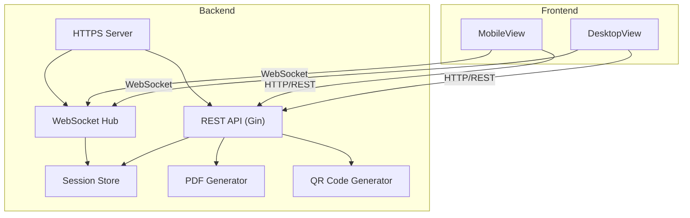
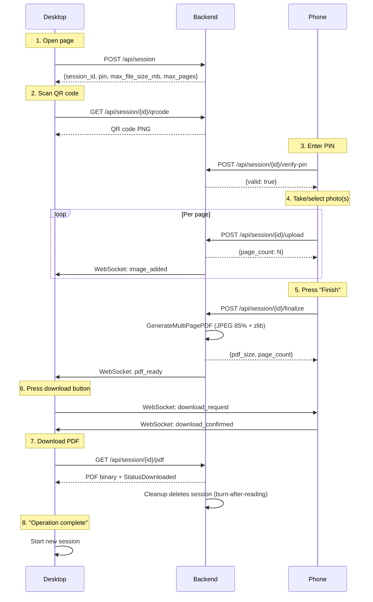
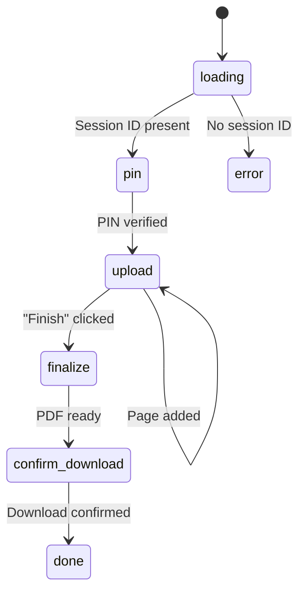
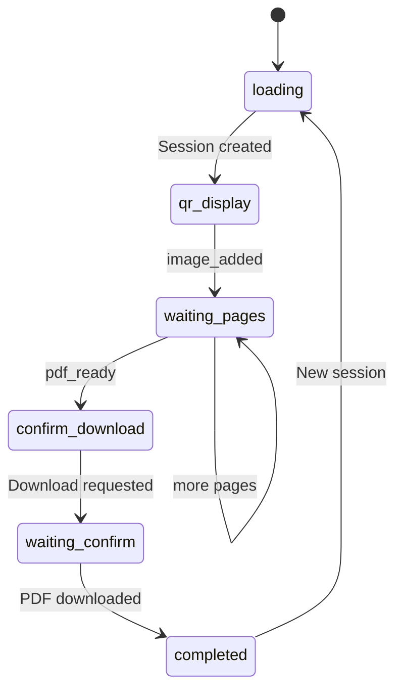
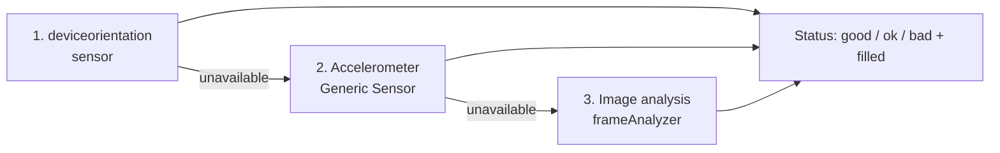
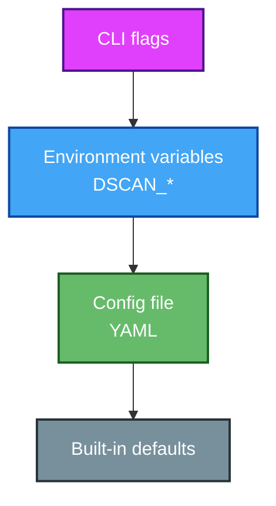
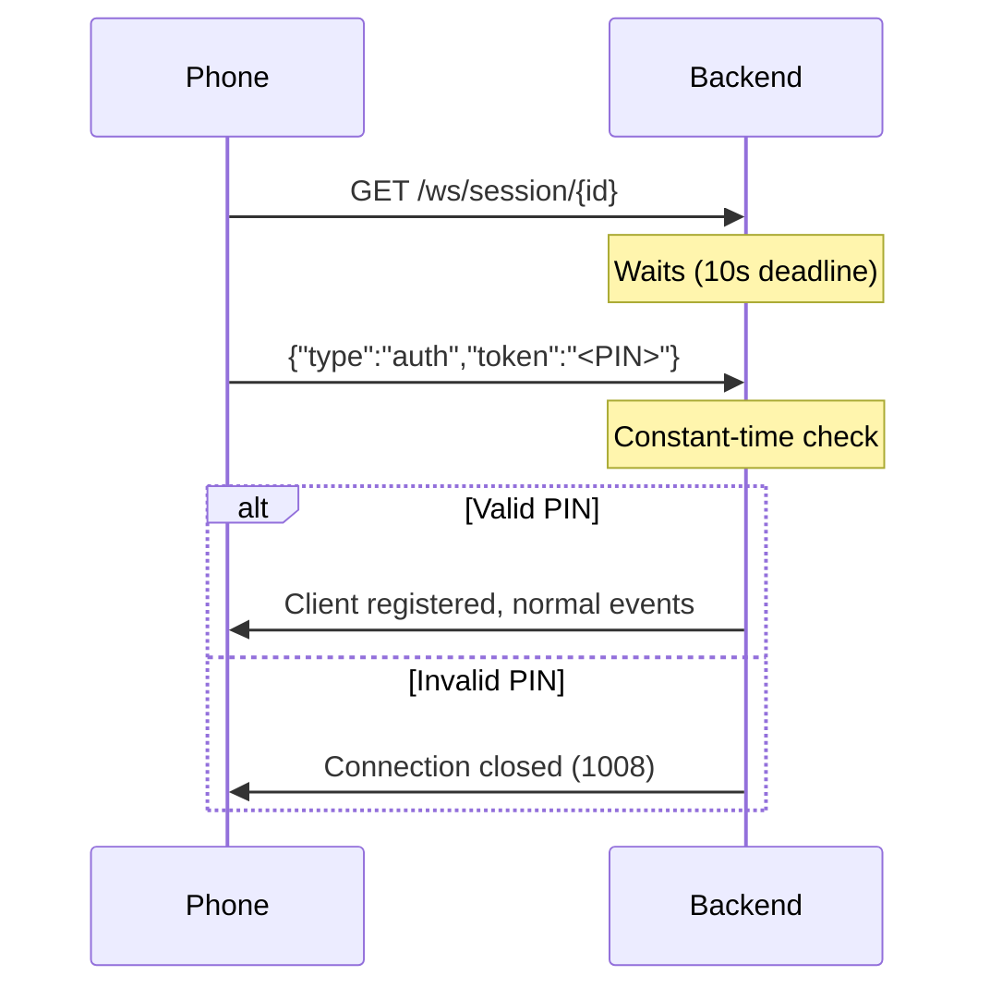
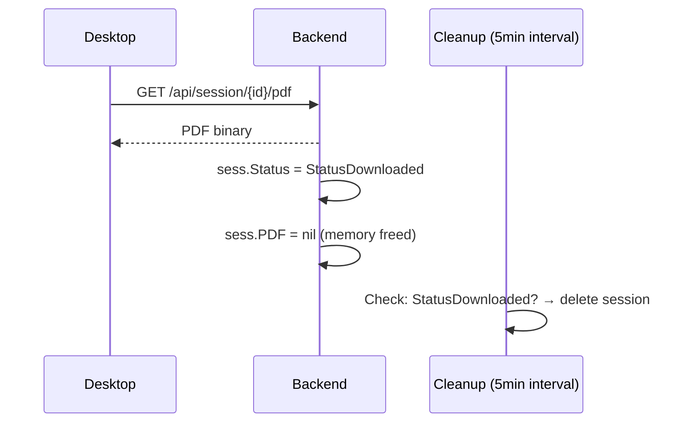

# DocFlow - User Manual

*Version: 2026-09-15. This manual is the source documentation for users and
operators. Architecture details: [map.md](../map.md), configuration and
build commands: [README.md](../README.md). German version: [manual.md](manual.md).*

---

## Contents

1. [What is DocFlow?](#1-what-is-docflow)
2. [Quick Guide: The Workflow](#2-quick-guide-the-workflow)
3. [Installation & Startup](#3-installation--startup)
4. [Configuration](#4-configuration)
5. [Security & Privacy](#5-security--privacy)
6. [API Reference](#6-api-reference)
7. [Troubleshooting](#7-troubleshooting)
8. [Internet Operation (Hosting)](#8-internet-operation-hosting)
9. [System Limitations](#9-system-limitations)

---

## 1. What is DocFlow?

DocFlow is a web-based document scanner: the desktop shows a QR code, the
phone connects, takes photos and uploads them - the server turns them into
a multi-page PDF. All without cloud, without email, without installing
anything on the phone. By default the connection runs over the local
network; you always operate a **self-hosted instance** - in the LAN just
the same as on a self-hosted public server (chapter 8).

| Feature | Description |
|---------|-------------|
| Session management | Temporary sessions with 6-digit PIN and configurable timeout |
| QR code connection | Automatic LAN IP detection, phone connects by scanning |
| Multi-page upload | Multiple photos per session, editable (rotate, crop) |
| Tilt indicator | Live hint while taking photos whether the document is straight in the frame |
| Multilingual UI | German and English, chosen automatically per browser language |
| PDF creation | Multi-page PDF with JPEG compression (default 85%) |
| Real time | WebSocket updates: the desktop instantly sees when a page arrives |
| Burn-after-Reading | Session including all images is deleted after the PDF download |
| HTTPS | Self-signed certificate is generated automatically at startup |

### System overview



### Tech stack

| Layer | Technology |
|-------|------------|
| Backend | Go 1.26 / Gin / gorilla/websocket / go-pdf/fpdf |
| Frontend | Vue 3 / Vite / Pinia / vue-i18n / Vitest |
| Configuration | Viper (YAML + ENV + CLI flags) |
| Logging | log/slog (JSON, stdlib) |

---

## 2. Quick Guide: The Workflow

### Flow at a glance



### Desktop

1. **Start the server** (see chapter 3) and open
   `https://<host>:8082` in the browser - confirm the
   self-signed certificate warning once
2. **Create a session** - QR code and PIN appear
3. Wait until the phone uploads photos (page counter updates live)
4. After "Finish" on the phone: **download the PDF**
5. The session is deleted automatically (burn-after-reading)

### Phone

1. **Scan the QR code** with the camera app - the browser opens the
   mobile view
2. **Enter the 6-digit PIN** (shown next to the QR code on the desktop) -
   after three failed attempts the input is locked temporarily
3. **Take photos** or choose from the gallery - multiple pages are
   possible; each page can be rotated or cropped before upload
4. Tap **"Finish"** - the server generates the PDF
5. Once the desktop requests the download it is confirmed; the mobile
   view shows "operation complete"

### Screen flows

Mobile view:



Desktop view:



### Tilt indicator while taking photos

While the camera is open, DocFlow shows live whether the document is
straight and fills the frame (status good/ok/bad + "filled"). Detection
works in three stages with automatic fallback:



1. Device sensor (`deviceorientation`) - iOS with granted permission, Firefox
2. Accelerometer (Generic Sensor) - Chrome/Android
3. Image analysis - always available, even when a browser silently blocks
   sensors (e.g. Brave); works via grayscale segmentation and
   rectangle/perspective checks directly in the browser

All three paths run entirely client-side - the images are not uploaded for
this purpose.

### Language

The interface is available in German and English; the language is chosen
automatically from the browser setting.

---

## 3. Installation & Startup

### Variant A: Single binary (recommended)

```bash
# Build yourself (requires Go >= 1.26 and Node >= 22)
make release          # from the project root

# Or cross-compile
make release-linux    # -> backend/docflow-linux-amd64
```

Start:

```bash
./docflow
# → https://localhost:8082
```

On first start without a configuration file, a fully commented
`config.yaml` is written automatically to the first writable location
(`./`, `./config/`, `/etc/docflow/`). An existing file is never
overwritten; on read-only filesystems the server continues with
built-in defaults.

### Variant B: Development

```bash
cd frontend/dokumentenscanner
npm install
npm run dev           # dev server with hot reload

cd backend
make frontend-build   # build and embed the frontend (needed once)
make run              # HTTPS on port 8082
```

### Variant C: Docker

```bash
docker build -t docflow .
docker run -p 8082:8082 \
  -e DSCAN_SERVER_PUBLIC_URL=https://<server-ip>:8082 \
  docflow
```

The image is multi-stage (Node → Go → Alpine) and runs with an
unprivileged user. **Important:** `DSCAN_SERVER_PUBLIC_URL` must point to
the host's LAN address - the QR code contains the address the server sees
for itself, and inside a container that is the internal Docker bridge IP,
unreachable from the phone. The same applies when running behind a
reverse proxy (use the proxy address). Without the value, LAN IP
auto-detection applies (bare-metal operation). Note: the Docker variant
was validated on a test server on 2026-09-15 (image build, container
operation, workflow).

---

## 4. Configuration

All settings can be set via four sources, priority from top to bottom:



1. **CLI flags**: `--port`, `--host`, `--config <path>`,
   `--ws-origins`, `--ws-allow-private-ips`
2. **Environment variables** with prefix `DSCAN_`
   (e.g. `DSCAN_SERVER_PORT=9000`)
3. **YAML file** (search paths: `./`, `./config/`, `/etc/docflow/`, or
   explicit via `--config`)
4. **Built-in defaults**

The most important settings (excerpt; fully commented in the
auto-generated `config.yaml` and in README "Configuration"):

| Setting | ENV variable | Default |
|---------|--------------|---------|
| Port | `DSCAN_SERVER_PORT` | `8082` |
| Session timeout | `DSCAN_SESSION_TIMEOUT` | `1h` |
| PIN attempts until lockout | `DSCAN_SESSION_MAX_FAILED_ATTEMPTS` | `3` |
| Lockout duration | `DSCAN_SESSION_LOCKOUT_DURATION` | `5m` |
| Max file size per image | `DSCAN_UPLOAD_MAX_FILE_SIZE_MB` | `10` |
| Max pages per PDF | `DSCAN_PDF_MAX_PAGES` | `20` |
| JPEG quality | `DSCAN_PDF_JPEG_QUALITY` | `85` |
| Allowed WS origins | `DSCAN_WEB_SOCKET_ALLOWED_ORIGINS` | localhost |
| Log level / format | `DSCAN_LOGGING_LEVEL` / `_FORMAT` | `info` / `json` |
| Rate limiting | `DSCAN_RATE_LIMIT_*` | active, 100 req./60s |

Predefined profiles live in `backend/config/`: `config.yaml` (default),
`config.dev.yaml` (debug, generous limits), `config.prod.yaml` (port 443,
own TLS certificates, private IPs locked out).

### YAML hierarchy

The configuration is organised as a nested YAML structure - all ENV
variables and flags are just alternative access paths to the same fields
(`DSCAN_SERVER_PORT` corresponds to `server.port` in the YAML, for
example):

```mermaid
graph TD
    root[Config] --> server[Server]
    root --> session[Session]
    root --> upload[Upload]
    root --> pdf[PDF]
    root --> websocket[WebSocket]
    root --> logging[Logging]
    root --> rate_limit[RateLimit]

    server --> port["port: 8082"]
    server --> host["host: 0.0.0.0"]
    server --> tls["tls_cert_path / tls_key_path"]
    session --> timeout["timeout: 1h"]
    session --> cleanup["cleanup_interval: 5m"]
    session --> max_failed["max_failed_attempts: 3"]
    session --> lockout["lockout_duration: 5m"]
    upload --> max_file_size_mb["max_file_size_mb: 10"]
    upload --> allowed_types["allowed_types: [jpeg, png, webp]"]
    pdf --> max_pages["max_pages: 20"]
    pdf --> jpeg_quality["jpeg_quality: 85"]
    pdf --> compress_output["compress_output: true"]
    websocket --> allowed_origins["allowed_origins"]
    websocket --> allow_private_ips["allow_private_ips: true"]
    websocket --> deadlines["read_deadline / ping_interval"]
    logging --> level["level: info"]
    logging --> format["format: json"]
    rate_limit --> enabled["enabled: true"]
    rate_limit --> max_requests["max_requests: 100"]
    rate_limit --> window_seconds["window_seconds: 60"]
```



### YAML example

The server generates the file fully commented on first start; the most
important blocks look like this:

```yaml
server:
  port: "8082"                      # HTTPS port
  host: "0.0.0.0"
  tls_cert_path: ""                 # empty = auto-generated certificate
  tls_key_path: ""

session:
  timeout: 1h                       # session lives at most 1 hour
  cleanup_interval: 5m              # cleanup interval (expired/downloaded)
  max_failed_attempts: 3            # PIN failures until lockout
  lockout_duration: 5m              # duration of the PIN lockout

upload:
  max_file_size_mb: 10              # max size per image
  allowed_types:                    # MIME types
    - "image/jpeg"
    - "image/png"
    - "image/webp"

pdf:
  max_pages: 20                     # max pages per PDF
  jpeg_quality: 85                  # JPEG compression (1-100)
  compress_output: true             # JPEG compression enabled

websocket:
  read_deadline: 60s                # read timeout per connection
  ping_interval: 30s                # keep-alive pings
  allowed_origins:                  # only these origins may connect
    - "https://localhost:8082"
    - "http://localhost:8082"
    - "https://127.0.0.1:8082"
    - "http://127.0.0.1:8082"
  allow_private_ips: true           # allow LAN access

logging:
  level: "info"                     # debug | info | warn | error
  format: "json"                    # json | text

rate_limit:
  enabled: true
  max_requests: 100                 # per time window
  window_seconds: 60
```

---

## 5. Security & Privacy

DocFlow is privacy-by-design: documents and images exist exclusively in
RAM, nothing is written to disk and nothing is sent - except to the
devices that connect to the instance themselves. When operating on the
internet, the notes in chapter 8 apply additionally.

| Measure | Implementation |
|---------|----------------|
| RAM-only | Images and PDF live only in memory; everything is freed after the download |
| Burn-after-Reading | After the PDF download the session including images is deleted immediately |
| Session timeout | Inactive sessions are cleaned up after at most 1h (configurable) |
| PIN | 6-digit, `crypto/rand`, constant-time comparison, lockout after failed attempts |
| WebSocket auth | The PIN is sent as the first message - never in URLs (otherwise it would end up in logs) |
| HTTPS | Auto-generated TLS certificate or own certificates via config |
| Access logs | No IP addresses, no query strings, no PIN |
| Upload limit | `io.LimitReader` enforces the configured size limit |
| Security headers | HSTS, CSP, X-Frame-Options and more |
| Rate limiting | Configurable per-IP limit for API endpoints |

### WebSocket authentication

The PIN is sent as the **first message** over the WebSocket connection -
never as a URL parameter (otherwise it would end up in access logs and
reverse proxy logs):



### Burn-after-Reading



The full privacy policy: [PRIVACY.en.md](PRIVACY.en.md) (English) or
[PRIVACY.md](PRIVACY.md) (German).

---

## 6. API Reference

| Method | Endpoint | Description | Response |
|--------|----------|-------------|----------|
| POST | `/api/session` | Create session | `{session_id, pin, max_file_size_mb, max_pages}` |
| POST | `/api/session/{id}/verify-pin` | Verify PIN | `{valid, message}` |
| GET | `/api/session/{id}/qrcode` | QR code PNG | PNG binary |
| POST | `/api/session/{id}/upload` | Upload image | `{message, page_count}` |
| POST | `/api/session/{id}/finalize` | Generate PDF | `{page_count, pdf_size}` |
| GET | `/api/session/{id}/pdf` | Download PDF | PDF binary + session delete |
| DELETE | `/api/session/{id}` | Delete session | 204 |
| GET | `/ws/session/{id}` | WebSocket connection | Auth message, then JSON events |

WebSocket events (after a successful auth message):

| Event | Direction | Content |
|-------|-----------|---------|
| `auth` (first message) | Client → Server | `{type, token}` - never rebroadcast |
| `image_added` | Server → Desktop | `{session_id, page_count}` |
| `pdf_ready` | Server → Desktop | `{session_id, page_count}` |
| `download_request` | Desktop → Mobile | `{session_id}` |
| `download_confirmed` | Mobile → Desktop | `{session_id}` |

---

## 7. Troubleshooting

| Problem | Solution |
|---------|----------|
| Certificate warning in the browser | Expected with a self-signed certificate - accept once, or add own certificates via `server.tls_cert_path`/`tls_key_path` |
| Phone cannot reach the server | Desktop and phone must be in the same LAN; check the firewall port; the QR code shows the detected LAN IP automatically |
| PIN rejected although correct | After 3 failed attempts the session is locked - wait out the lockout duration (default 5 min) or start a new session |
| Tilt indicator not reacting | The browser may be blocking sensors - DocFlow automatically switches to image analysis; grant camera permission if needed |
| Upload fails | Image size or page count exceeded (defaults: 10 MB/image, 20 pages) |
| Session suddenly gone | Session timeout expired (default 1 h) - simply create a new session |
| No image update on the desktop | Check the WebSocket connection; the PIN is sent as the first message, a proxy must not break the connection |

---

## 8. Internet Operation (Hosting)

DocFlow is not limited to the LAN. The security mechanisms (chapter 5) -
rate limiting, constant-time PIN comparison with lockout logic,
WebSocket origin check, security headers, upload limits and privacy
logging - exist exactly so the instance can also be operated publicly
without turning into an open mailbox.

### Hardening checklist for public instances

| Measure | Implementation |
|---------|----------------|
| Real TLS certificate | Set `server.tls_cert_path`/`tls_key_path` (e.g. Let's Encrypt) instead of the auto-generated self-signed certificate |
| Port | `DSCAN_SERVER_PORT=443`, or use the profile `backend/config/config.prod.yaml` as a starting point |
| Public URL | Set `DSCAN_SERVER_PUBLIC_URL=https://<public-address>` when the instance runs in a container, behind a reverse proxy or under a dedicated domain name - the QR code must contain the address reachable from the phone |
| Lock out private IPs | `DSCAN_WEB_SOCKET_ALLOW_PRIVATE_IPS=false` - reject WebSocket connections from private address ranges |
| Pin origins | Set `DSCAN_WEB_SOCKET_ALLOWED_ORIGINS` to the public domain (default allows localhost only) |
| Review rate limiting | For public instances consider stricter values (`DSCAN_RATE_LIMIT_MAX_REQUESTS`) |
| Cap file sizes | Keep `DSCAN_UPLOAD_MAX_FILE_SIZE_MB` moderate to make abuse harder |
| Reverse proxy optional | Put nginx/Caddy in front (termination, additional limits); the proxy must not break the WebSocket connection |

Without this hardening the instance runs with the secure defaults - but
those are calibrated for LAN operation (e.g. `allow_private_ips: true`,
localhost origins).

### Responsibility & Liability

DocFlow is a tool: the project provides the software and documents how to
operate it securely. For the **operation of an instance and its content**
responsibility lies entirely with the operator - including applicable
legal frameworks (e.g. GDPR, mandatory legal notices/imprint, host
liability). The project itself assumes no responsibility, no liability
for uploaded content and no warranty for the legal compliance of a
specific installation.

Consequences for operators:

- Anyone operating an instance publicly is its operator in the legal
  sense and should provide imprint/privacy policy
- Since content lives only in RAM and is deleted after the download,
  data minimisation is technically given - GDPR deletion obligations are
  easy to satisfy with this design (see [PRIVACY.en.md](PRIVACY.en.md))
- Abuse (illegal content) cannot be fully excluded technically; anyone
  unwilling to carry that risk operates the instance on the LAN only or
  behind a login (e.g. reverse proxy with Basic Auth)

---

## 9. System Limitations

- Up to 20 pages per session and 10 MB per image (configurable)
- JPEG quality 85% in the PDF (configurable)
- Single-instance operation: sessions live in RAM, a restart discards all
  running sessions; no multi-server/cluster operation
- No user accounts: access control runs via session + PIN; anyone needing
  permanently closed instances wraps that in front (e.g. reverse proxy
  auth)
- LAN operation is documented and tested; public operation is intended by
  design (chapter 8) but must be hardened by the operator
