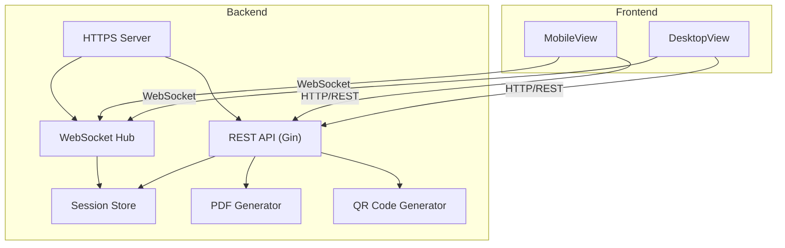
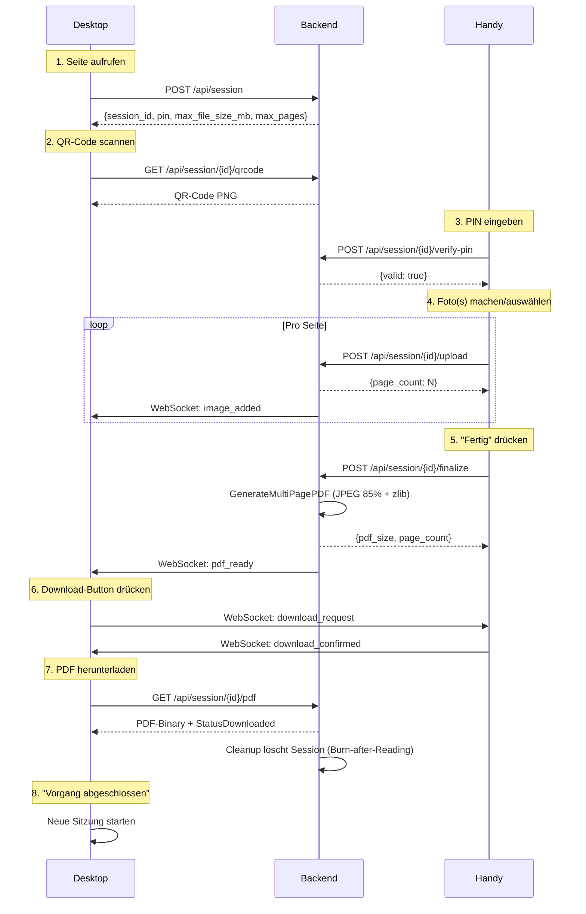
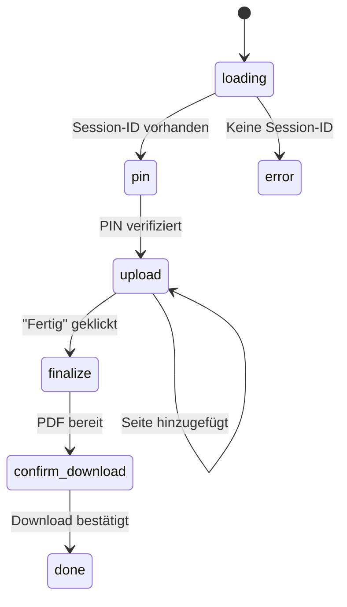
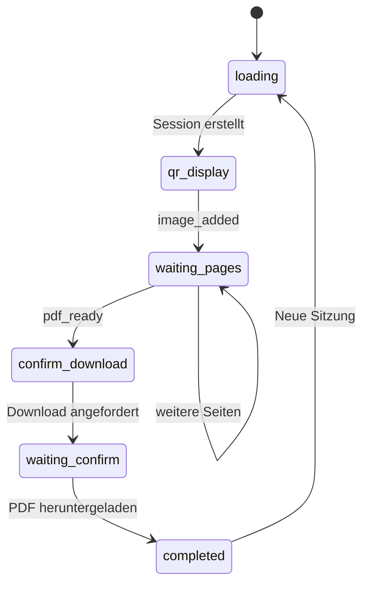
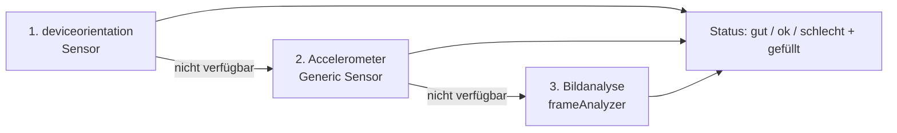
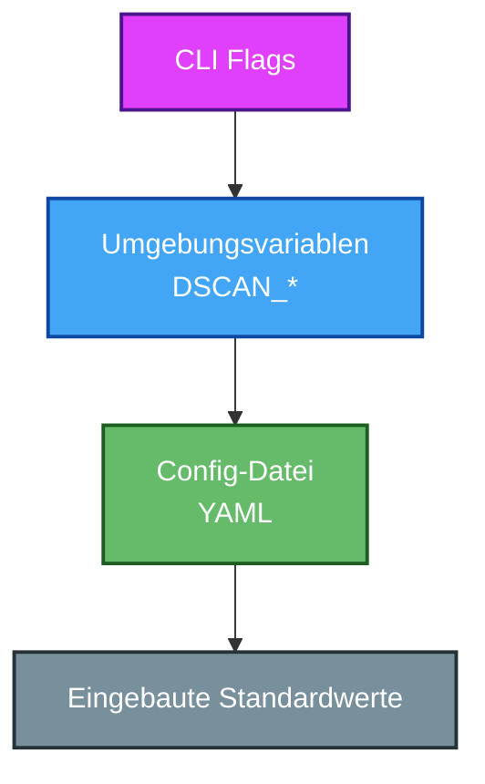
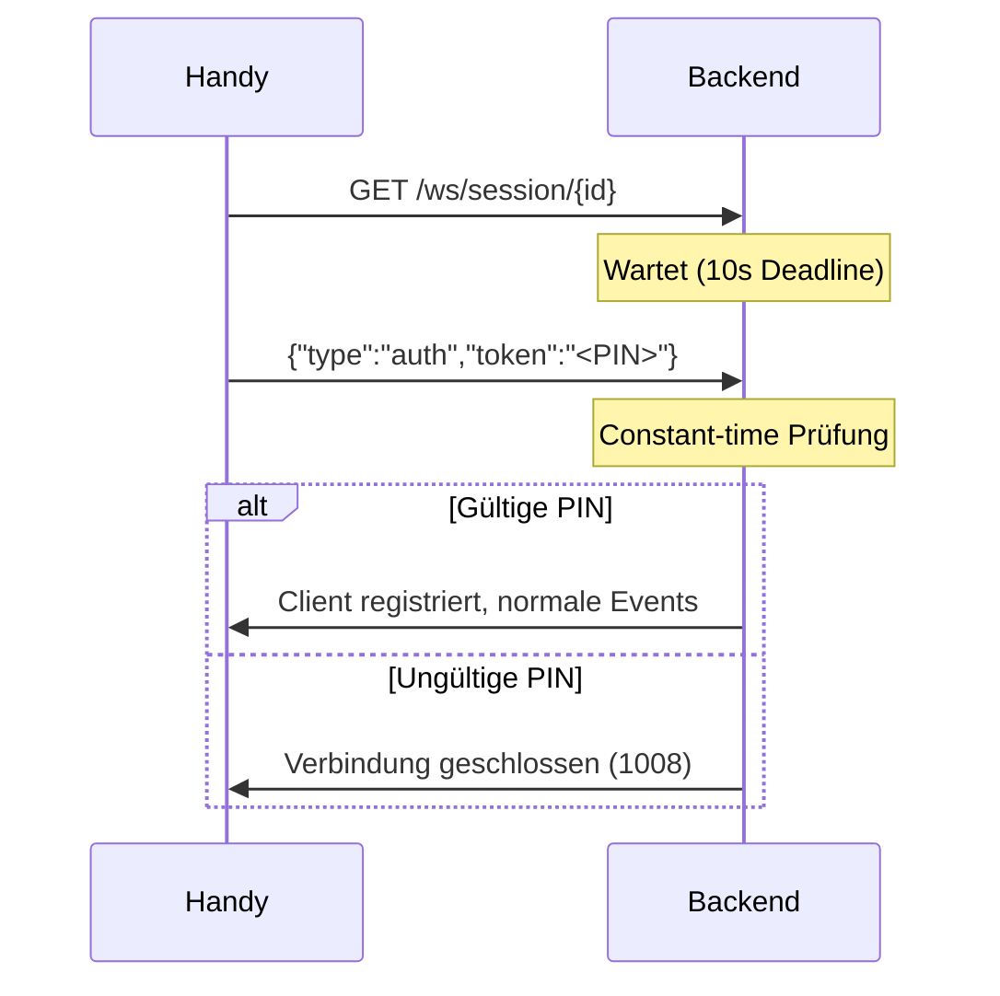
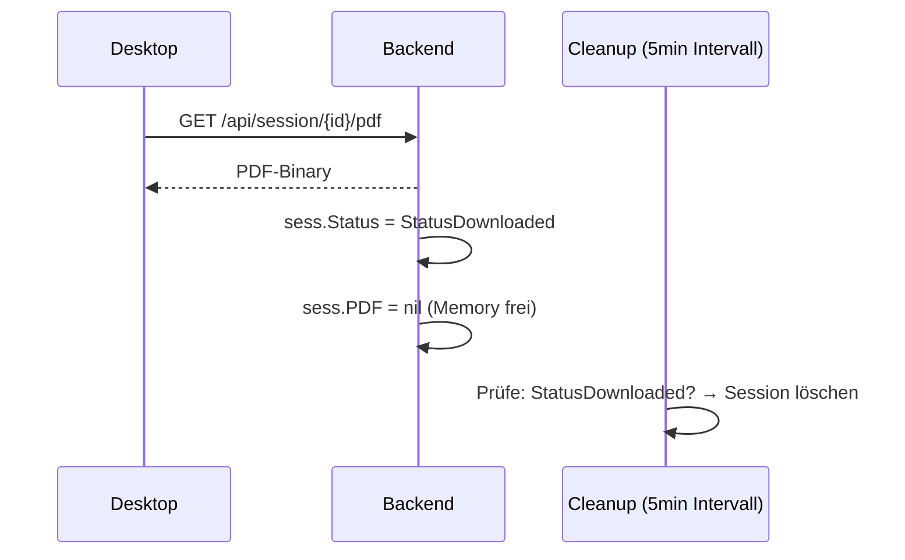

# DocFlow - Benutzerhandbuch

*Stand: 2026-09-15. Dieses Handbuch ist die Quell-Dokumentation für Nutzer
und Betreiber. Englische Fassung: [manual.en.md](manual.en.md).
Architektur-Details: [map.md](../map.md), Konfiguration im
Detail: [README.md](../README.md) "Configuration", Build-Kommandos:
[AGENTS.md](../AGENTS.md).*

---

## Inhalt

1. [Was ist DocFlow?](#1-was-ist-docflow)
2. [Kurzanleitung: Der Workflow](#2-kurzanleitung-der-workflow)
3. [Installation & Start](#3-installation--start)
4. [Konfiguration](#4-konfiguration)
5. [Sicherheit & Datenschutz](#5-sicherheit--datenschutz)
6. [API-Referenz](#6-api-referenz)
7. [Fehlerbehebung](#7-fehlerbehebung)
8. [Betrieb im Internet (Hosting)](#8-betrieb-im-internet-hosting)
9. [Grenzen des Systems](#9-grenzen-des-systems)

---

## 1. Was ist DocFlow?

DocFlow ist ein web-basierter Dokumentenscanner: Der Desktop zeigt einen
QR-Code, das Handy verbindet sich, macht Fotos und lädt sie hoch - der
Server erzeugt daraus ein mehrseitiges PDF. Alles ohne Cloud, ohne E-Mail,
ohne Installation auf dem Handy. Standard läuft die Verbindung über das
lokale Netzwerk; betrieben wird eine **eigene Instanz** - im LAN genau
so wie auf einem selbst gehosteten Server (Kapitel 8).

| Feature | Beschreibung |
|---------|--------------|
| Session-Management | Temporäre Sessions mit 6-stelliger PIN und konfigurierbarem Timeout |
| QR-Code-Verbindung | Automatische LAN-IP-Erkennung, Handy verbindet sich per Scan |
| Multi-Page-Upload | Mehrere Fotos pro Session, bearbeitbar (drehen, zuschneiden) |
| Kipp-Indikator | Live-Hinweis beim Fotografieren, ob das Dokument gerade im Rahmen liegt |
| Mehrsprachigkeit | Deutsch und Englisch, automatisch je Browser-Sprache |
| PDF-Erzeugung | Mehrseitiges PDF mit JPEG-Komprimierung (Standard 85%) |
| Echtzeit | WebSocket-Updates: Desktop sieht sofort, wenn eine Seite ankommt |
| Burn-after-Reading | Session inkl. aller Bilder wird nach dem PDF-Download gelöscht |
| HTTPS | Selbstsigniertes Zertifikat wird beim Start automatisch erzeugt |

### Systemübersicht



### Technologie-Stack

| Schicht | Technologie |
|---------|-------------|
| Backend | Go 1.26 / Gin / gorilla/websocket / go-pdf/fpdf |
| Frontend | Vue 3 / Vite / Pinia / vue-i18n / Vitest |
| Konfiguration | Viper (YAML + ENV + CLI Flags) |
| Logging | log/slog (JSON, stdlib) |

---

## 2. Kurzanleitung: Der Workflow

### Ablauf im Überblick



### Desktop

1. **Server starten** (siehe Kapitel 3) und
   `https://<host>:8082` im Browser öffnen - die
   Selbstsigniert-Zertifikat-Warnung einmalig bestätigen
2. **Session erstellen** - QR-Code und PIN erscheinen
3. Warten, bis das Handy Fotos hochlädt (Seitenzähler aktualisiert sich
   live)
4. Nach dem "Fertigstellen" auf dem Handy: **PDF herunterladen**
5. Die Session wird automatisch gelöscht (Burn-after-Reading)

### Handy

1. **QR-Code scannen** mit der Kamera-App - der Browser öffnet die
   Mobile-Anzeige
2. **6-stellige PIN eingeben** (steht neben dem QR-Code auf dem Desktop) -
   nach drei Fehlversuchen wird die Eingabe vorübergehend gesperrt
3. **Fotos machen** oder aus der Galerie wählen - mehrere Seiten sind
   möglich, jede Seite kann vor dem Hochladen gedreht oder zugeschnitten
   werden
4. **"Fertig"** tippen - der Server erzeugt das PDF
5. Sobald der Desktop den Download anfordert, wird das bestätigt; die
   Mobile-Anzeige zeigt "Vorgang abgeschlossen"

### Bildschirm-Abläufe

Mobile-Ansicht:



Desktop-Ansicht:



### Kipp-Indikator beim Fotografieren

Während die Kamera offen ist, zeigt DocFlow live an, ob das Dokument gerade
liegt und den Rahmen ausfüllt (Status gut/ok/schlecht + "gefüllt"). Die
Erkennung arbeitet dreistufig mit automatischem Fallback:



1. Gerätesensor (`deviceorientation`) - iOS mit erteilter Erlaubnis, Firefox
2. Accelerometer (Generic Sensor) - Chrome/Android
3. Bildanalyse - immer verfügbar, auch wenn ein Browser Sensoren still
   blockiert (z.B. Brave); funktioniert über Grauwert-Segmentierung und
   Rechteck-/Perspektiven-Prüfung direkt im Browser

Alle drei Wege laufen komplett clientseitig - die Bilder werden dafür nicht
hochgeladen.

### Sprache

Die Oberfläche ist auf Deutsch und Englisch verfügbar; die Sprache wird
automatisch aus der Browsereinstellung gewählt.

---

## 3. Installation & Start

### Variante A: Single Binary (empfohlen)

```bash
# Selbst bauen (benötigt Go >= 1.26 und Node >= 22)
make release          # aus dem Projektstamm

# Oder cross-kompilieren
make release-linux    # -> backend/docflow-linux-amd64
```

Start:

```bash
./docflow
# → https://localhost:8082
```

Beim ersten Start ohne Konfigurationsdatei wird automatisch eine komplett
kommentierte `config.yaml` an den ersten schreibbaren Ort geschrieben
(`./`, `./config/`, `/etc/docflow/`). Eine bestehende Datei wird nie
überschrieben; auf schreibgeschützten Dateisystemen läuft der Server mit
integrierten Standardwerten weiter.

### Variante B: Entwicklung

```bash
cd frontend/dokumentenscanner
npm install
npm run dev           # Dev-Server mit Hot-Reload

cd backend
make frontend-build   # Frontend bauen und einbetten (einmalig nötig)
make run              # HTTPS auf Port 8082
```

### Variante C: Docker

```bash
docker build -t docflow .
docker run -p 8082:8082 docflow
```

Das Image ist Multi-Stage (Node → Go → Alpine) und läuft mit einem
nicht-privilegierten Benutzer. Hinweis: Die Docker-Variante ist strukturell
fertig, wurde aber noch nicht am laufenden System validiert (siehe
`docs/release-plan.md`, Aufgabe 5).

---

## 4. Konfiguration

Alle Einstellungen lassen sich über vier Quellen setzen, Priorität von oben
nach unten:



1. **CLI-Flags**: `--port`, `--host`, `--config <pfad>`,
   `--ws-origins`, `--ws-allow-private-ips`
2. **Umgebungsvariablen** mit Präfix `DSCAN_`
   (z.B. `DSCAN_SERVER_PORT=9000`)
3. **YAML-Datei** (Suchpfade: `./`, `./config/`, `/etc/docflow/`, oder
   explizit per `--config`)
4. **Eingebaute Standardwerte**

Die wichtigsten Einstellungen (Auszug; vollständig kommentiert in der
auto-generierten `config.yaml` und in README "Configuration"):

| Einstellung | ENV-Variable | Standard |
|-------------|--------------|----------|
| Port | `DSCAN_SERVER_PORT` | `8082` |
| Session-Timeout | `DSCAN_SESSION_TIMEOUT` | `1h` |
| PIN-Fehlversuche bis Sperre | `DSCAN_SESSION_MAX_FAILED_ATTEMPTS` | `3` |
| Sperrdauer | `DSCAN_SESSION_LOCKOUT_DURATION` | `5m` |
| Max. Dateigröße pro Bild | `DSCAN_UPLOAD_MAX_FILE_SIZE_MB` | `10` |
| Max. Seiten pro PDF | `DSCAN_PDF_MAX_PAGES` | `20` |
| JPEG-Qualität | `DSCAN_PDF_JPEG_QUALITY` | `85` |
| Zulässige WS-Origins | `DSCAN_WEB_SOCKET_ALLOWED_ORIGINS` | localhost |
| Log-Level / -Format | `DSCAN_LOGGING_LEVEL` / `_FORMAT` | `info` / `json` |
| Rate-Limiting | `DSCAN_RATE_LIMIT_*` | aktiv, 100 Req./60s |

Vorgefertigte Profile liegen in `backend/config/`: `config.yaml` (Standard),
`config.dev.yaml` (Debug, großzügige Limits), `config.prod.yaml` (Port 443,
eigene TLS-Zertifikate, private IPs gesperrt).

### YAML-Hierarchie

Die Konfiguration ist als verschachtelte YAML-Struktur organisiert - alle
ENV-Variablen und Flags sind nur Alternativezugriffe auf dieselben Felder
(`DSCAN_SERVER_PORT` entspricht z.B. `server.port` in der YAML):

```mermaid
graph TD
    root[Config] --> server[Server]
    root --> session[Session]
    root --> upload[Upload]
    root --> pdf[PDF]
    root --> websocket[WebSocket]
    root --> logging[Logging]
    root --> rate_limit[RateLimit]

    server --> port["port: 8082"]
    server --> host["host: 0.0.0.0"]
    server --> tls["tls_cert_path / tls_key_path"]
    session --> timeout["timeout: 1h"]
    session --> cleanup["cleanup_interval: 5m"]
    session --> max_failed["max_failed_attempts: 3"]
    session --> lockout["lockout_duration: 5m"]
    upload --> max_file_size_mb["max_file_size_mb: 10"]
    upload --> allowed_types["allowed_types: [jpeg, png, webp]"]
    pdf --> max_pages["max_pages: 20"]
    pdf --> jpeg_quality["jpeg_quality: 85"]
    pdf --> compress_output["compress_output: true"]
    websocket --> allowed_origins["allowed_origins"]
    websocket --> allow_private_ips["allow_private_ips: true"]
    websocket --> deadlines["read_deadline / ping_interval"]
    logging --> level["level: info"]
    logging --> format["format: json"]
    rate_limit --> enabled["enabled: true"]
    rate_limit --> max_requests["max_requests: 100"]
    rate_limit --> window_seconds["window_seconds: 60"]
```



### YAML-Beispiel

Vollständig kommentiert generiert der Server die Datei beim ersten Start;
die wichtigsten Blöcke sehen so aus:

```yaml
server:
  port: "8082"                      # HTTPS-Port
  host: "0.0.0.0"
  tls_cert_path: ""                 # leer = automatisch generiertes Zertifikat
  tls_key_path: ""

session:
  timeout: 1h                       # Session lebt max. 1 Stunde
  cleanup_interval: 5m              # Aufräum-Intervall (expired/downloaded)
  max_failed_attempts: 3            # PIN-Fehlversuche bis zur Sperre
  lockout_duration: 5m              # Dauer der PIN-Sperre

upload:
  max_file_size_mb: 10              # Max. Größe pro Bild
  allowed_types:                    # MIME-Types
    - "image/jpeg"
    - "image/png"
    - "image/webp"

pdf:
  max_pages: 20                     # Max. Seiten pro PDF
  jpeg_quality: 85                  # JPEG-Kompression (1-100)
  compress_output: true             # JPEG-Kompression aktiv

websocket:
  read_deadline: 60s                # Lese-Timeout pro Verbindung
  ping_interval: 30s                # Keep-Alive-Pings
  allowed_origins:                  # Nur diese Origins dürfen verbinden
    - "https://localhost:8082"
    - "http://localhost:8082"
    - "https://127.0.0.1:8082"
    - "http://127.0.0.1:8082"
  allow_private_ips: true           # LAN-Zugriff erlauben

logging:
  level: "info"                     # debug | info | warn | error
  format: "json"                    # json | text

rate_limit:
  enabled: true
  max_requests: 100                 # pro Zeitfenster
  window_seconds: 60
```

---

## 5. Sicherheit & Datenschutz

DocFlow ist Privacy-by-design: Dokumente und Bilder existieren ausschließlich
im Arbeitsspeicher, es wird nichts auf die Festplatte geschrieben und nichts
gesendet - außer an die Geräte, die sich selbst mit der Instanz verbinden.
Bei Betrieb im Internet gelten zusätzlich die Hinweise in Kapitel 8.

| Massnahme | Umsetzung |
|-----------|-----------|
| RAM-only | Bilder und PDF leben nur im Speicher; nach dem Download wird alles freigegeben |
| Burn-after-Reading | Nach dem PDF-Download wird die Session inkl. Bilder sofort gelöscht |
| Session-Timeout | Inaktive Sessions werden spätestens nach 1h (konfigurierbar) bereinigt |
| PIN | 6-stellig, `crypto/rand`, constant-time Vergleich, Sperre nach Fehlversuchen |
| WebSocket-Auth | Die PIN wird als erste Nachricht gesendet - niemals in URLs (sonst würde sie in Logs landen) |
| HTTPS | Automatisch generiertes TLS-Zertifikat oder eigene Zertifikate via Config |
| Access-Logs | Ohne IP-Adressen, ohne Query-Strings, ohne PIN |
| Upload-Begrenzung | `io.LimitReader` erzwingt das konfigurierte Größenlimit |
| Security-Header | HSTS, CSP, X-Frame-Options u.a. |
| Rate-Limiting | Konfigurierbares Limit pro IP für API-Endpunkte |

### WebSocket-Authentifizierung

Die PIN wird als **erste Nachricht** über die WebSocket-Verbindung gesendet -
niemals als URL-Parameter (sie würde sonst in Access-Logs und
Reverse-Proxy-Logs landen):



### Burn-after-Reading



Die vollständige Datenschutz-Erklärung: [PRIVACY.md](PRIVACY.md) (Deutsch)
bzw. [PRIVACY.en.md](PRIVACY.en.md) (Englisch).

---

## 6. API-Referenz

| Methode | Endpunkt | Beschreibung | Response |
|---------|----------|--------------|----------|
| POST | `/api/session` | Session erstellen | `{session_id, pin, max_file_size_mb, max_pages}` |
| POST | `/api/session/{id}/verify-pin` | PIN prüfen | `{valid, message}` |
| GET | `/api/session/{id}/qrcode` | QR-Code PNG | PNG-Binary |
| POST | `/api/session/{id}/upload` | Bild hochladen | `{message, page_count}` |
| POST | `/api/session/{id}/finalize` | PDF generieren | `{page_count, pdf_size}` |
| GET | `/api/session/{id}/pdf` | PDF herunterladen | PDF-Binary + Session-Delete |
| DELETE | `/api/session/{id}` | Session löschen | 204 |
| GET | `/ws/session/{id}` | WebSocket-Verbindung | Auth-Nachricht, dann JSON-Events |

WebSocket-Events (nach erfolgreicher Auth-Nachricht):

| Event | Richtung | Inhalt |
|-------|----------|--------|
| `auth` (erste Nachricht) | Client → Server | `{type, token}` - wird nie rebroadcastet |
| `image_added` | Server → Desktop | `{session_id, page_count}` |
| `pdf_ready` | Server → Desktop | `{session_id, page_count}` |
| `download_request` | Desktop → Mobile | `{session_id}` |
| `download_confirmed` | Mobile → Desktop | `{session_id}` |

---

## 7. Fehlerbehebung

| Problem | Lösung |
|---------|--------|
| Zertifikatswarnung im Browser | Erwartet bei selbstsigniertem Zertifikat - einmalig akzeptieren oder eigene Zertifikate via `server.tls_cert_path`/`tls_key_path` einbinden |
| Handy erreicht den Server nicht | Desktop und Handy müssen im selben LAN sein; Firewall-Port prüfen; QR-Code zeigt automatisch die erkannte LAN-IP an |
| PIN wird abgelehnt, obwohl korrekt | Nach 3 Fehlversuchen ist die Session gesperrt - die Sperrdauer (Standard 5 min) abwarten oder eine neue Session starten |
| Kipp-Indikator reagiert nicht | Der Browser blockiert möglicherweise Sensoren - DocFlow wechselt automatisch auf Bildanalyse; ggf. Kamera-Berechtigung erteilen |
| Upload schlägt fehl | Bildgröße oder Seitenzahl überschritten (Standard: 10 MB/Bild, 20 Seiten) |
| Session plötzlich weg | Session-Timeout abgelaufen (Standard 1 h) - einfach eine neue Session erstellen |
| Kein Bild-Update auf dem Desktop | WebSocket-Verbindung prüfen; die PIN wird als erste Nachricht gesendet, ein Proxy darf die Verbindung nicht umbrechen |

---

## 8. Betrieb im Internet (Hosting)

DocFlow ist nicht auf das LAN beschränkt. Die Sicherheitsmechanismen
(Kapitel 5) - Rate-Limiting, constant-time PIN-Vergleich mit Sperrlogik,
WebSocket-Origin-Check, Security-Header, Upload-Begrenzung und
Privacy-Logging - sind genau dafür da, dass die Instanz auch öffentlich
erreichbar betrieben werden kann, ohne zu einem offenen Briefkasten zu
werden.

### Härtungs-Checkliste für öffentliche Instanzen

| Massnahme | Umsetzung |
|-----------|-----------|
| Echtes TLS-Zertifikat | `server.tls_cert_path`/`tls_key_path` setzen (z.B. Let's Encrypt) statt des automatisch generierten Selbstsigniert-Zertifikats |
| Port | `DSCAN_SERVER_PORT=443` bzw. das Profil `backend/config/config.prod.yaml` als Ausgangspunkt nutzen |
| Private IPs sperren | `DSCAN_WEB_SOCKET_ALLOW_PRIVATE_IPS=false` - WebSocket-Verbindungen aus privaten Adressräumen ablehnen |
| Origins festnageln | `DSCAN_WEB_SOCKET_ALLOWED_ORIGINS` auf die öffentliche Domain setzen (Default erlaubt nur localhost) |
| Rate-Limiting prüfen | Für öffentliche Instanzen ggf. strenger (`DSCAN_RATE_LIMIT_MAX_REQUESTS`) |
| Dateigrößen deckeln | `DSCAN_UPLOAD_MAX_FILE_SIZE_MB` moderat halten, um Missbrauch zu erschweren |
| Reverse-Proxy optional | nginx/Caddy vorschalten (Terminierung, zusätzliche Limits); Proxy darf die WebSocket-Verbindung nicht umbrechen |

Ohne diese Härtung läuft die Instanz mit den sicheren Defaults - die
sind aber für LAN-Betrieb kalibriert (z.B. `allow_private_ips: true`,
localhost-Origins).

### Verantwortung & Haftung

DocFlow ist ein Werkzeug: Das Projekt stellt die Software bereit und
dokumentiert, wie man sie sicher betreibt. Für den **Betrieb einer
Instanz und deren Inhalt** liegt die Verantwortung vollständig beim
Betreiber - inklusive geltender Rechtslagen (z.B. DSGVO, Impressumspflicht,
Hosterhaftung). Das Projekt selbst übernimmt dafür keine Verantwortung,
keine Haftung für hochgeladene Inhalte und keine Gewähr für die
Rechtskonformität einer konkreten Installation.

Konsequenzen für Betreiber:

- Wer eine Instanz öffentlich betreibt, ist deren Betreiber im rechtlichen
  Sinne und sollte Impressum/Datenschutzerklärung bereitstellen
- Da Inhalte nur im RAM leben und nach dem Download gelöscht werden, ist
  die Datenminimierung technisch gegeben - die DSGVO-Pflichten zur
  Löschung lassen sich damit leicht erfüllen (siehe [PRIVACY.md](PRIVACY.md))
- Missbrauch (illegale Inhalte) lässt sich technisch nicht vollständig
  ausschließen; wer das Risiko nicht tragen will, betreibt die Instanz nur
  im LAN oder hinter einer Anmeldung (z.B. Reverse-Proxy mit Basic Auth)

---

## 9. Grenzen des Systems

- Bis zu 20 Seiten pro Session und 10 MB pro Bild (konfigurierbar)
- JPEG-Qualität 85% im PDF (konfigurierbar)
- Single-Instance-Betrieb: Sessions liegen im RAM, ein Neustart verwirft alle
  laufenden Sessions; kein Multi-Server-/Cluster-Betrieb
- Keine Benutzerkonten: Die Zugangskontrolle läuft über Session + PIN;
  wer dauerhaft geschlossene Instanzen braucht, kapselt das dahinter
  (z.B. Reverse-Proxy-Auth)
- Dokumentiert und getestet ist der LAN-Betrieb; der öffentliche Betrieb
  ist konzeptionell vorgesehen (Kapitel 8), aber vom Betreiber zu härten
