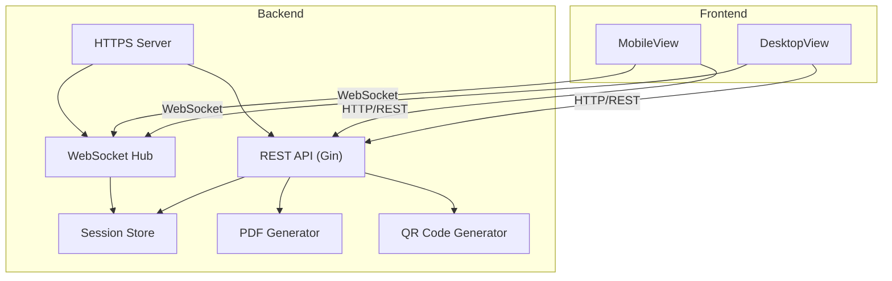
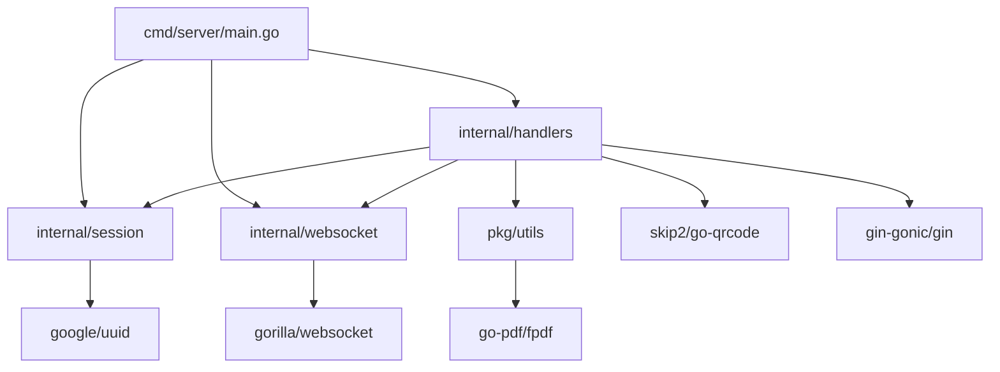
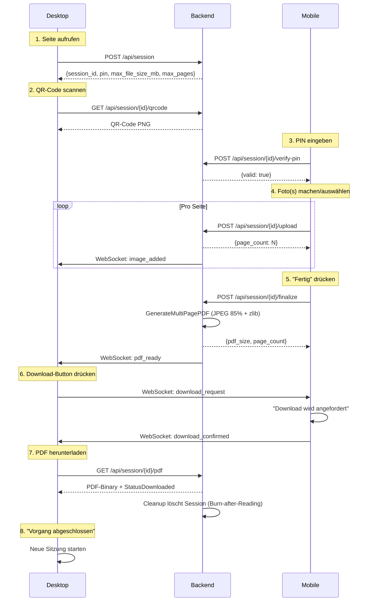
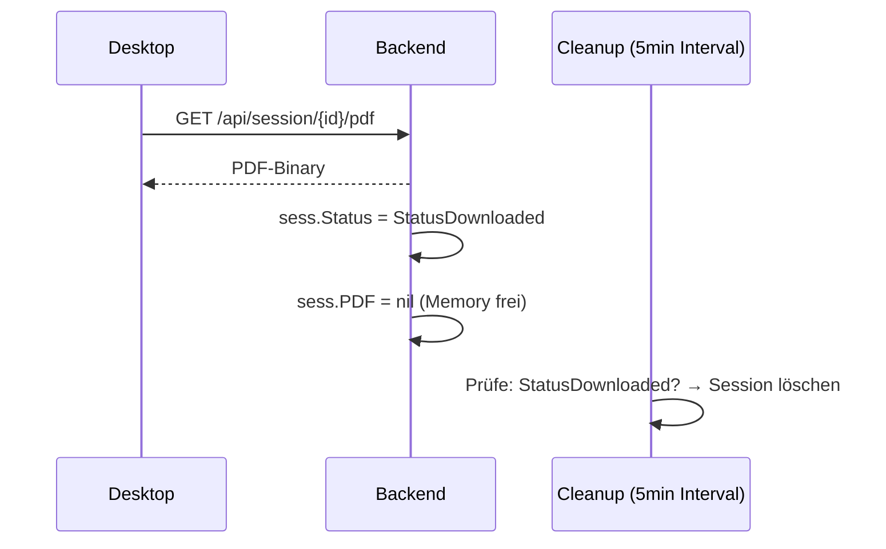
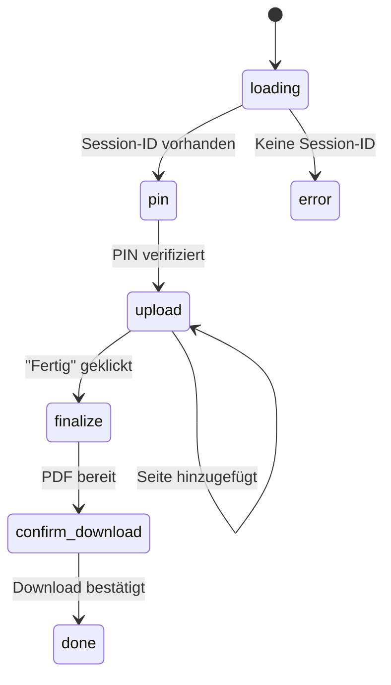
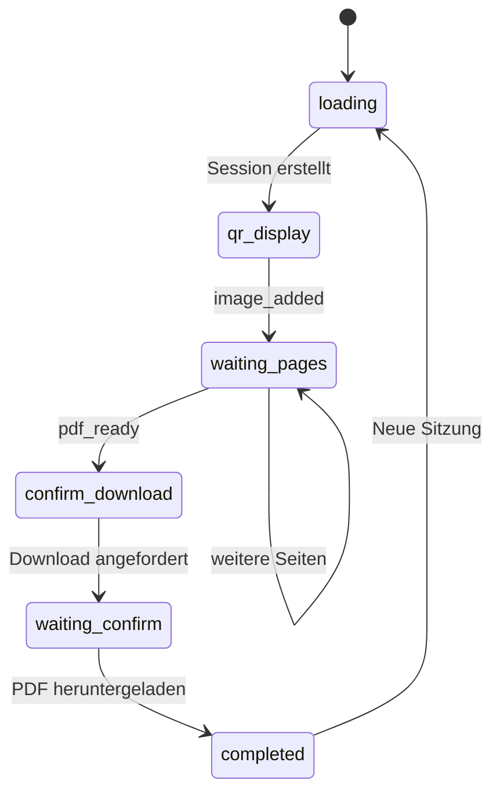
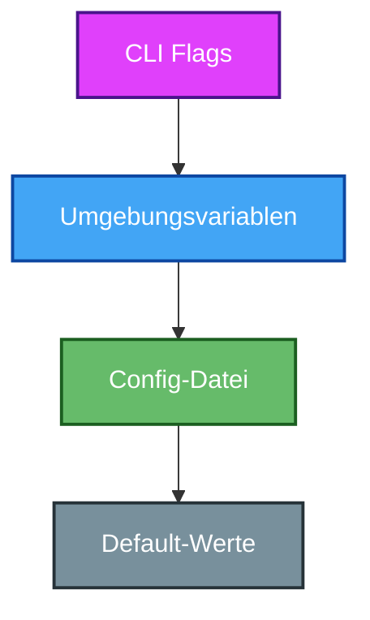
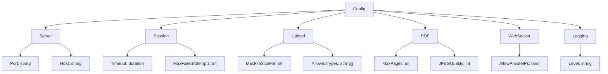

# Dokumentenscanner – Projekt-Dokumentation

*Zentrale Dokumentation für Architektur, Entwicklung und Betrieb. Stand: 2026-07-25*

---

## 1. Überblick

### Was ist der Dokumentenscanner?

Eine Web-Anwendung zum Übertragen von Dokumenten zwischen **Desktop** und **Mobilgerät** über das lokale Netzwerk — ohne Cloud, ohne E-Mail.

| Feature | Beschreibung |
|---------|--------------|
| **Session-Management** | Temporäre Sessions mit 6-stelliger PIN und 1h Timeout |
| **QR-Code-Verbindung** | Automatische LAN-IP-Erkennung für simple Verbindung |
| **Multi-Page Upload** | Mehrere Fotos pro Session, bearbeitbar (Drehen, Crop) |
| **PDF-Konvertierung** | Server-seitige mehrseitige PDF mit JPEG-Komprimierung (85%) |
| **WebSocket-Kommunikation** | Echtzeit-Bestätigung zwischen Desktop und Mobile |
| **Burn-after-Reading** | Session wird nach PDF-Download automatisch gelöscht |
| **HTTPS** | Selbstsigniertes TLS-Zertifikat (im Binary eingebettet) |

### Technologie-Stack

| Schicht | Technologie |
|---------|-------------|
| Backend | Go 1.21+ / Gin / gorilla/websocket / go-pdf/fpdf |
| Frontend | Vue 3 / Vite / Pinia / Axios / Vitest |
| Konfiguration | Viper (YAML + ENV + CLI Flags) |
| Logging | log/slog (JSON, stdlib) |

---

## 2. Architektur

### Systemübersicht



### Go-Pakete



### Verzeichnisstruktur

```
NeuDocumentenScaner/
├── backend/
│   ├── cmd/server/
│   │   ├── main.go              # Server-Start, Graceful Shutdown, Router
│   │   ├── cert.pem / key.pem   # TLS (embedded)
│   │   ├── index.html + assets/ # Frontend SPA (embedded)
│   │   └── *_test.go
│   ├── internal/
│   │   ├── config/              # Viper-Konfiguration
│   │   │   ├── config.go        # Config-Struct + LoadConfig + Defaults
│   │   │   └── config_test.go
│   │   ├── handlers/            # HTTP-Handler
│   │   │   ├── deps.go          # Dependency Injection
│   │   │   ├── session.go       # CreateSession, VerifyPIN, DeleteSession
│   │   │   ├── qrcode.go        # QR-Code (LAN-IP auto-detect)
│   │   │   ├── upload.go        # Bild-Upload + image_added Event
│   │   │   ├── finalize.go      # Multi-Page Finalize + PDF-Generierung
│   │   │   ├── pdf.go           # PDF-Download + Burn-after-Reading
│   │   │   └── websocket.go     # WebSocket-Handler + Origin-Check
│   │   ├── session/             # Session-Management
│   │   │   ├── session.go       # Session-Struktur (Images [][]byte)
│   │   │   ├── pin.go           # PIN-Generierung + Verifizierung
│   │   │   └── cleanup.go       # Auto-Cleanup (nach Download oder 1h)
│   │   └── websocket/           # WebSocket-Hub
│   │       └── hub.go           # Client-Management + Broadcast
│   ├── pkg/utils/
│   │   ├── pdf.go               # GenerateMultiPagePDF + JPEG-Komprimierung
│   │   └── pdf_test.go
│   └── Makefile
├── frontend/
│   └── dokumentenscanner/
│       ├── src/
│       │   ├── views/
│       │   │   ├── DesktopView.vue    # QR-Anzeige → Download → Complete
│       │   │   └── MobileView.vue     # PIN → Upload → Finalize → Bestätigung
│       │   ├── components/
│       │   │   ├── QRCodeDisplay.vue  # QR-Code + PIN-Anzeige
│       │   │   ├── PINInput.vue       # 6-stellige PIN mit Lock-Feedback
│       │   │   └── ImageUpload.vue    # Multi-Page: Kamera/Galerie + Crop/Rotate + Page-Liste
│       │   ├── stores/sessionStore.ts # Pinia State (images[], maxFileSizeMB, maxPages)
│       │   ├── utils/
│       │   │   ├── api.ts             # Axios: REST-API + finalizeUpload
│       │   │   └── websocket.ts       # WebSocket-Client (image_added, download_request, etc.)
│       │   ├── __tests__/             # 85 Frontend-Tests (Vitest)
│       │   └── router/index.ts        # Hash-Routing (Desktop/Mobile)
│       ├── vite.config.ts             # Vite + Vitest
│       └── package.json
└── map.md
```

---

## 3. Datenfluss

### Gesamter Workflow



### WebSocket-Nachrichten

| Event | Richtung | Inhalt |
|-------|----------|--------|
| `image_added` | Server → Desktop | `{session_id, page_count}` |
| `pdf_ready` | Server → Desktop | `{session_id, page_count}` |
| `download_request` | Desktop → Mobile | `{session_id}` |
| `download_confirmed` | Mobile → Desktop | `{session_id}` |

---

## 4. Backend-Details

### Session-Struktur

```go
type Session struct {
    ID             uuid.UUID
    PIN            string       // 6-stellig, crypto/rand
    Images         [][]byte     // Mehrere Bilder pro Session
    PDF            []byte       // Generiertes PDF
    Status         SessionStatus
    CreatedAt      time.Time
    ExpiresAt      time.Time    // 1h nach Erstellung
    FailedAttempts int
    LockedUntil    time.Time
}

const (
    StatusWaitingForPIN = "waiting_for_pin"
    StatusUploadAllowed = "upload_allowed"
    StatusUploading     = "uploading"
    StatusUploaded      = "uploaded"
    StatusReady         = "ready"
    StatusDownloaded    = "downloaded"  // Trigger für Cleanup
)
```

### PDF-Generierung

`GenerateMultiPagePDF(images [][]byte, quality int)`:
- Pro Bild: `createImageBitmap` (EXIF-Orientierung) → Canvas → JPEG 85% → `RegisterImageReader`
- Pro Bild: `pdf.AddPage()` → auf A4 skalieren → zentrieren → `pdf.Image()`
- fpdf zlib-Komprimierung (Default aktiv)
- Keine Temp-Files auf der Platte

### Burn-after-Reading



### Sicherheit

| Massnahme | Umsetzung |
|-----------|-----------|
| PIN-Sperre | 1 Fehlversuch → 5 Min. Sperre |
| Session-Timeout | 1h Inaktivität |
| HTTPS | Selbstsigniertes Cert (embedded) |
| WebSocket-Auth | Session-ID im URL-Path |
| Origin-Check | Konfigurierbar (`AllowPrivateIPs`) |

---

## 5. Frontend-Details

### MobileView-Flow



### DesktopView-Flow



### ImageUpload-Komponente

| Modus | Beschreibung |
|-------|-------------|
| `choose` | Take Photo / Choose File + Page-Liste + "Generate PDF" Button |
| `camera` | Kamera-Vorschau + Aufnahme-Button |
| `edit` | Vorschau + Drehen (90° Schritte) + Crop + "Add Page" / "Update Page" |

- **Thumbnail-Klick** → Edit-Modus für dieses Bild
- **Upload** → Bild wird durch Canvas normalisiert (EXIF-Strip + Rotation)
- **Page-Liste** → Thumbnails mit Löschen-Button
- **MB-Fortschritt** → `X.X MB / Y MB` mit Farbbalken (>80% Warning)
- **Upload-Limit** → Dynamisch aus Config (`maxFileSizeMB`, `maxPages`)

---

## 6. Konfiguration

### Config-Priorität



### Config-Struktur



### Config-Dateien

| Datei | Zweck |
|-------|-------|
| `config.yaml` | Standard-Defaults |
| `config.dev.yaml` | Debug-Logging, 24h Timeout, 50MB Upload |
| `config.prod.yaml` | Port 443, TLS, private IPs gesperrt |

---

## 7. API-Referenz

### Endpunkte

| Methode | Endpunkt | Beschreibung | Response |
|---------|----------|--------------|----------|
| POST | `/api/session` | Session erstellen | `{session_id, pin, max_file_size_mb, max_pages}` |
| POST | `/api/session/{id}/verify-pin` | PIN prüfen | `{valid, message}` |
| GET | `/api/session/{id}/qrcode` | QR-Code PNG | PNG-Binary |
| POST | `/api/session/{id}/upload` | Bild hochladen | `{message, page_count}` |
| POST | `/api/session/{id}/finalize` | PDF generieren | `{page_count, pdf_size}` |
| GET | `/api/session/{id}/pdf` | PDF herunterladen | PDF-Binary + Session-Delete |
| DELETE | `/api/session/{id}` | Session löschen | 204 |
| GET | `/ws/session/{id}` | WebSocket-Verbindung | JSON-Events |

### WebSocket-Events

```json
// Server → Desktop (bei jedem Upload)
{"event": "image_added", "session_id": "uuid", "page_count": 3}

// Server → Desktop (nach Finalize)
{"event": "pdf_ready", "session_id": "uuid", "page_count": 3}

// Desktop → Mobile (Download angefordert)
{"event": "download_request", "data": {"session_id": "uuid"}}

// Mobile → Desktop (Download bestätigt)
{"event": "download_confirmed", "data": {"session_id": "uuid"}}
```

---

## 8. Entwicklung

### Build & Run

```bash
# Backend
cd backend
make lint          # go vet + gofmt
make test          # Alle Tests
make build         # Binary erstellen
make run           # HTTPS auf Port 8082

# Frontend
cd frontend/dokumentenscanner
npm install        # Dependencies
npm run dev        # Dev-Server mit Hot-Reload

# Komplett
cd frontend/dokumentenscanner && npm run build
cp -r dist/* ../../backend/cmd/server/
cd ../../backend && go build -o server ./cmd/server
./server
```

### Logging

`log/slog` mit JSON-Format:

| Level | Verwendung |
|-------|-----------|
| `DEBUG` | WebSocket-Nachrichten, Cleanup |
| `INFO` | Server-Start, Session-Erstellung, Upload |
| `WARN` | PIN-Fehler, Session nicht gefunden |
| `ERROR` | WebSocket-Fehler, PDF-Generierung fehlgeschlagen |

---

## 9. Testing

### Coverage

| Paket | Coverage |
|-------|----------|
| `internal/websocket` | **93.9%** |
| `pkg/utils` | 82.5% |
| `internal/config` | 75.2% |
| `internal/session` | 68.6% |
| `internal/handlers` | 71.3% |
| `cmd/server` | 51.4% |
| **Frontend (85 Tests)** | Alle grün ✅ |

### Tests ausführen

```bash
# Backend
cd backend && go test ./... -v && go test -cover ./...

# Frontend
cd frontend/dokumentenscanner && npx vitest run
```

---

## 10. Bekannte Bugs (alle behoben ✅)

| Bug | Lösung |
|-----|--------|
| Cleanup-Goroutine Leak | Session-Store Cleanup in main.go |
| Mutex-Deadlock | Redesign der Handler-Dependencies |
| WebSocket Timeouts | Config-basierte Timeouts + Ping/Pong |
| Origin-Check fehlgeschlagen | parseFlags DefValue-Check (config.go:158) |
| Doppelte WebSocket-Handler | emitEvent-Aufruf in handleMessage entfernt |
| DesktopView Handler-Leak | Named Functions + cleanup in onUnmounted |
| Bild-Ausrichtung verloren | Canvas-Normalisierung bei jedem Upload |

---

*Stand: 2026-07-25. Siehe auch [plan.md](plan.md) für den detaillierten Projektplan.*
