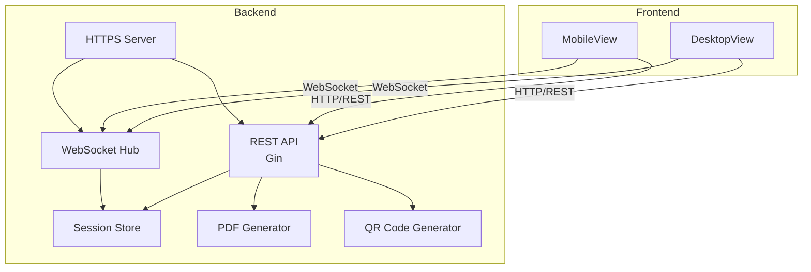
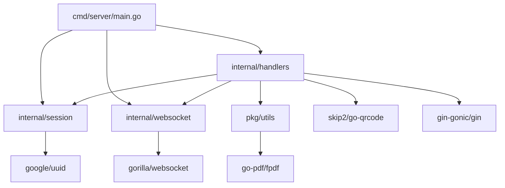
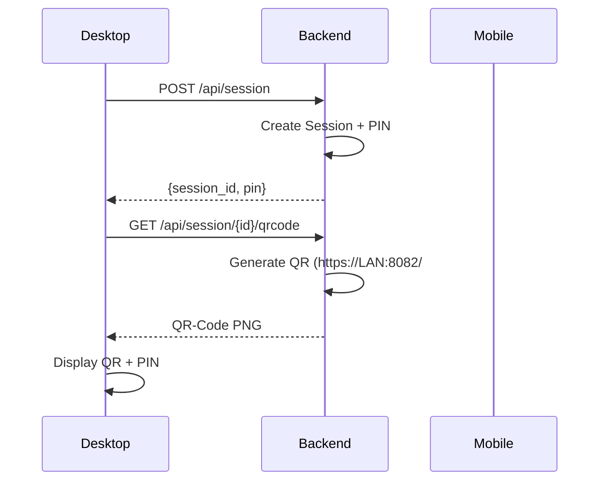
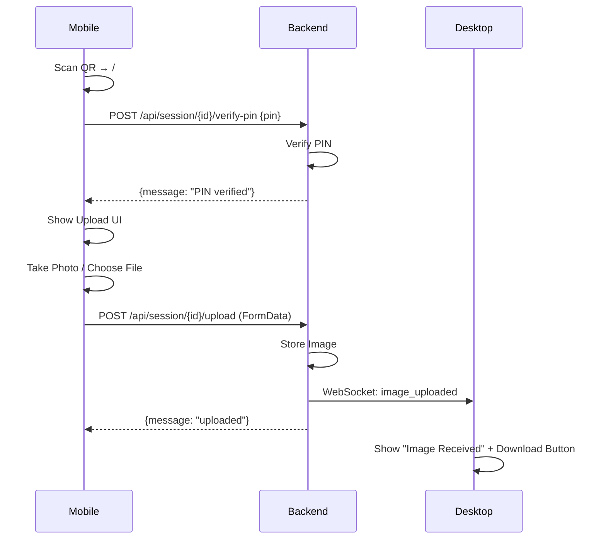
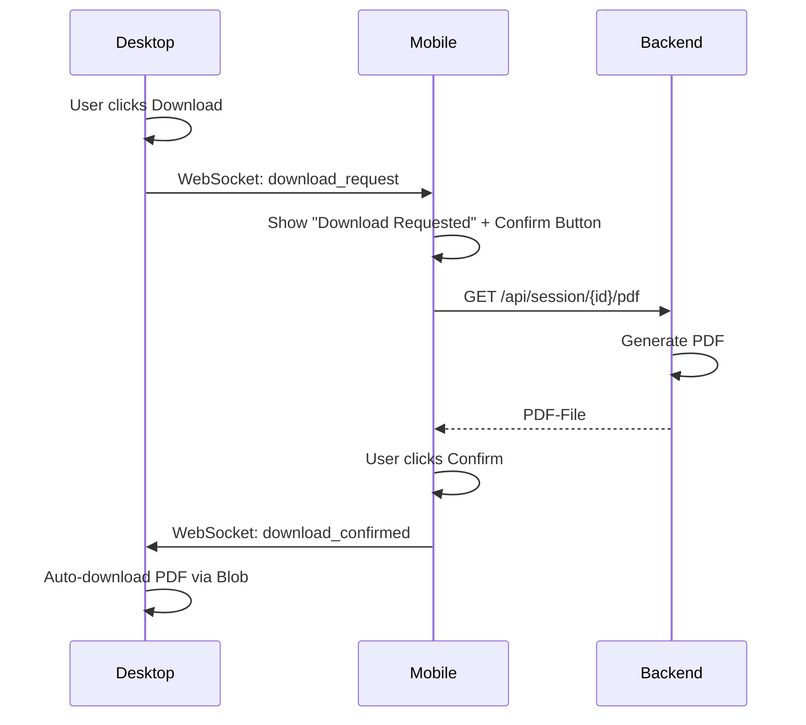
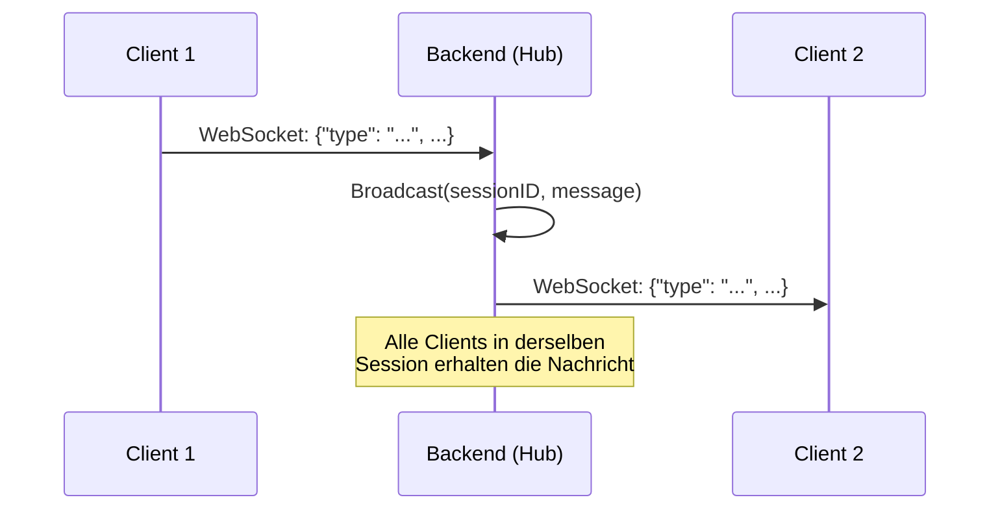
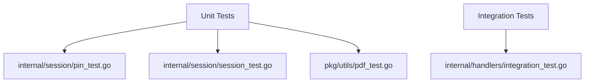

# Dokumentenscanner - Architekturübersicht

## Systemarchitektur



## Verzeichnisstruktur (aktuell)

```
NeuDocumentenScaner/
├── backend/
│   ├── cmd/server/
│   │   ├── main.go              # Server-Einstiegspunkt (HTTPS, Graceful Shutdown)
│   │   ├── cert.pem             # Self-signed TLS-Zertifikat (embedded)
│   │   ├── key.pem              # TLS-Private Key (embedded)
│   │   ├── index.html           # Frontend SPA (embedded)
│   │   └── assets/              # Frontend-Build-Assets (embedded)
│   │       ├── index-CicAdPgD.js
│   │       └── index-C0mBOPtv.css
│   ├── internal/
│   │   ├── handlers/            # HTTP-Handler
│   │   │   ├── session.go       # CreateSession, VerifyPIN, DeleteSession
│   │   │   ├── qrcode.go        # QR-Code-Generierung (LAN-IP auto-detect)
│   │   │   ├── upload.go        # Bild-Upload + WebSocket-Broadcast
│   │   │   ├── pdf.go           # PDF-Generierung + WebSocket-Broadcast
│   │   │   └── websocket.go     # WebSocket-Handler + Message-Forwarding
│   │   ├── session/             # Session-Management
│   │   │   ├── session.go       # Session-Struktur + Store (In-Memory)
│   │   │   ├── pin.go           # PIN-Generierung + Verifizierung
│   │   │   └── cleanup.go       # Session-Timeout (1h) + Auto-Cleanup
│   │   └── websocket/           # WebSocket-Hub
│   │       └── hub.go           # Client-Management + Broadcast
│   ├── pkg/utils/               # Utility-Funktionen
│   │   ├── pdf.go               # PDF-Generierung (gofpdf)
│   │   └── pdf_test.go          # PDF-Tests
│   ├── go.mod                   # Go-Modul
│   ├── go.sum                   # Abhängigkeiten
│   └── Makefile                 # Build-Skripts
├── frontend/
│   └── dokumentenscanner/
│       ├── index.html           # Lädt Inter-Font (Google Fonts)
│       ├── src/
│       │   ├── views/
│       │   │   ├── DesktopView.vue    # QR-Anzeige + Download
│       │   │   └── MobileView.vue     # PIN + Upload + Confirm
│       │   ├── components/
│       │   │   ├── QRCodeDisplay.vue  # QR-Code + PIN-Anzeige
│       │   │   ├── PINInput.vue       # 6-stellige PIN-Eingabe
│       │   │   └── ImageUpload.vue    # Kamera + Crop + Rotate
│       │   ├── stores/
│       │   │   └── sessionStore.ts    # Pinia State
│       │   ├── utils/
│       │   │   ├── api.ts             # Axios-Client
│       │   │   └── websocket.ts       # WebSocket-Client
│       │   ├── router/
│       │   │   └── index.ts           # Hash-Routing (Desktop/Mobile)
│       │   ├── assets/
│       │   │   └── main.css           # CSS Custom Properties
│       │   ├── App.vue
│       │   └── main.ts
│       └── vite.config.ts
└── map.md                        # Diese Datei
```

## Abhängigkeitsgraph (Go-Pakete)



## Paketabhängigkeiten (Detail)

### cmd/server/main.go
- **Zweck**: Server-Eintrittspunkt, HTTPS, Embedding
- **Abhängigkeiten**:
  - `internal/handlers` → HTTP-Handler
  - `internal/session` → Session-Store
  - `internal/websocket` → WebSocket-Hub
  - `github.com/gin-gonic/gin` → Web-Framework

### internal/handlers/*.go
- **Zweck**: HTTP-Request-Handler
- **Abhängigkeiten**:
  - `internal/session` → Session-Management
  - `pkg/utils` → PDF-Generierung
  - `github.com/gin-gonic/gin` → Routing
  - `github.com/gorilla/websocket` → WebSocket
  - `github.com/skip2/go-qrcode` → QR-Code

### internal/session/*.go
- **Zweck**: Session-Lebenszyklus-Management
- **Abhängigkeiten**:
  - `github.com/google/uuid` → Session-IDs
  - `time` → Timeouts
  - `sync` → Thread-Safety

### internal/websocket/hub.go
- **Zweck**: Echtzeit-Kommunikation
- **Abhängigkeiten**:
  - `github.com/gorilla/websocket` → WebSocket-Implementierung

### pkg/utils/*.go
- **Zweck**: PDF-Generierung
- **Abhängigkeiten**:
  - `github.com/go-pdf/fpdf` → PDF-Generierung

## Datenfluss

### 1. Session-Erstellung + QR-Code


### 2. Mobile: PIN + Upload


### 3. Download-Bestätigung via Mobile


### 4. WebSocket Message-Forwarding


## Teststruktur



## Metriken (aktuell)

| Metrik | Wert |
|--------|------|
| Go-Dateien | 14 |
| Frontend-Dateien | 12 (Vue/TS) |
| Testdateien | 4 |
| Unit-Tests | 11 |
| Integration-Tests | 1 |
| Externe Dependencies | 6 (Go) |

## Technologie-Stack

| Komponente | Technologie |
|------------|-------------|
| Backend-Framework | Gin v1.12.0 |
| Frontend-Framework | Vue 3 + Vite |
| State-Management | Pinia |
| Routing | vue-router (Hash-Mode) |
| WebSocket | gorilla/websocket v1.5.3 |
| PDF-Generierung | go-pdf/fpdf v0.9.0 |
| QR-Code | skip2/go-qrcode |
| TLS | Self-signed (im Binary embedded) |
| Logging | log/slog (stdlib) |
| Fonts | Inter (Google Fonts) |

## Bekannte Bugs (Phase 3.4)

| Bug | Datei | Beschreibung |
|-----|-------|-------------|
| Cleanup-Goroutine Leak | handlers/websocket.go | `StartCleanup()` wird pro WS-Connection aufgerufen |
| Mutex-Deadlock | websocket/hub.go | `broadcastMessage()` ruft `unregisterClient()` mit aktivem Lock auf |
| WebSocket Timeouts | handlers/websocket.go | Keine Read-Deadlines, kein Ping/Pong |

---

*Letzte Aktualisierung: 2026-07-24*
