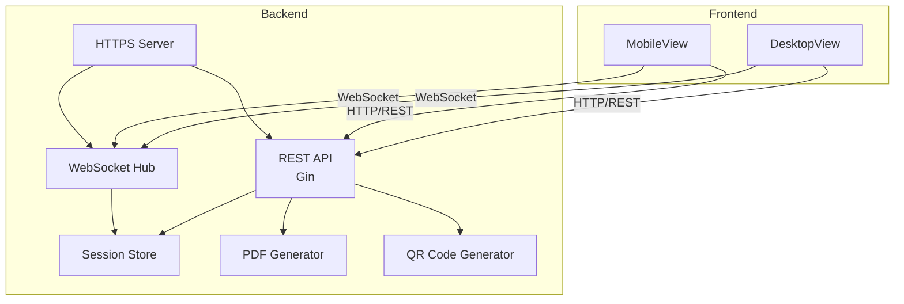
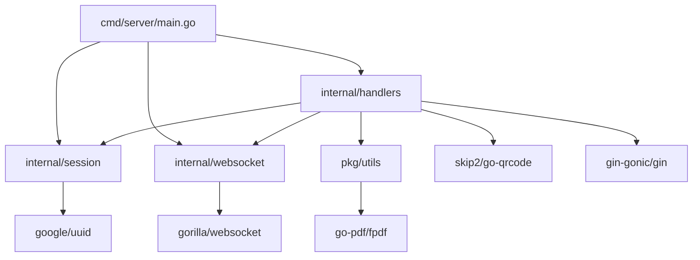
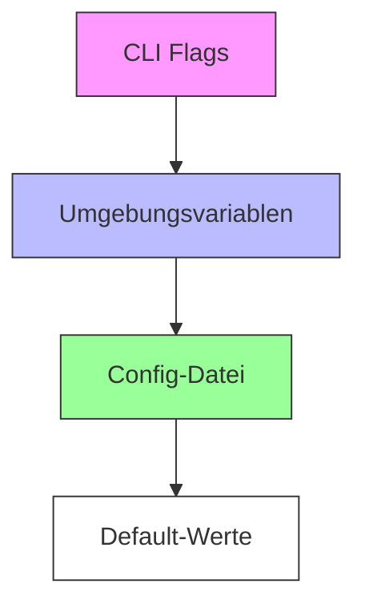
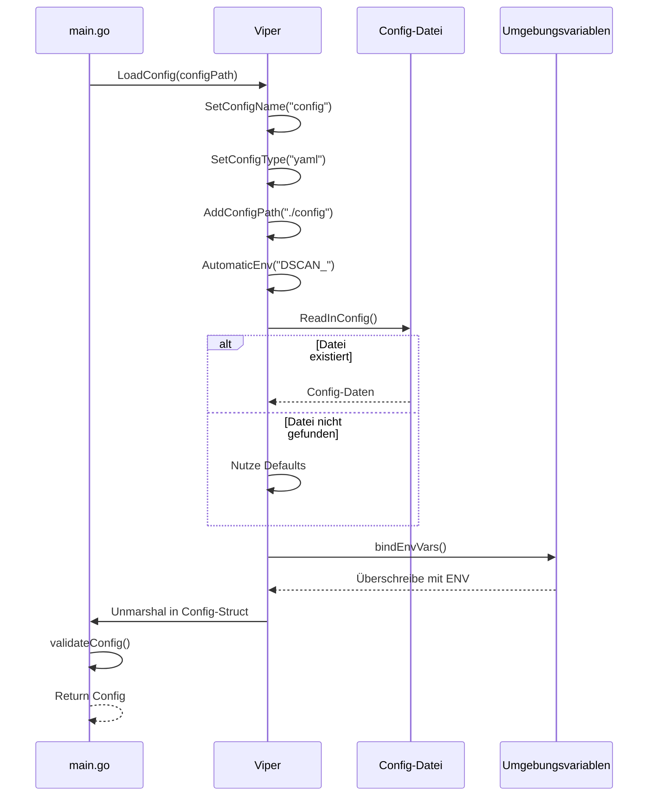
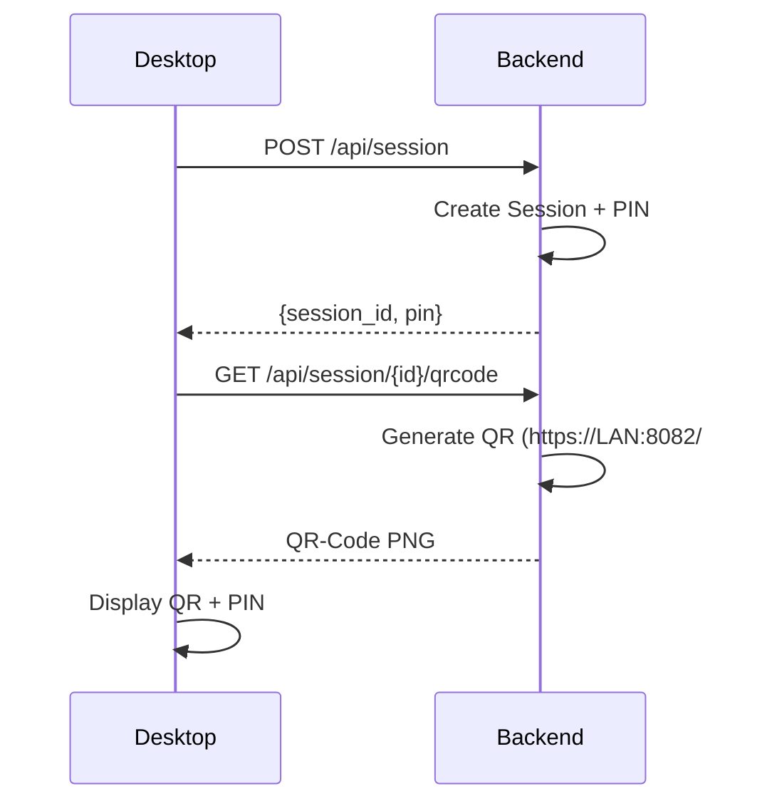
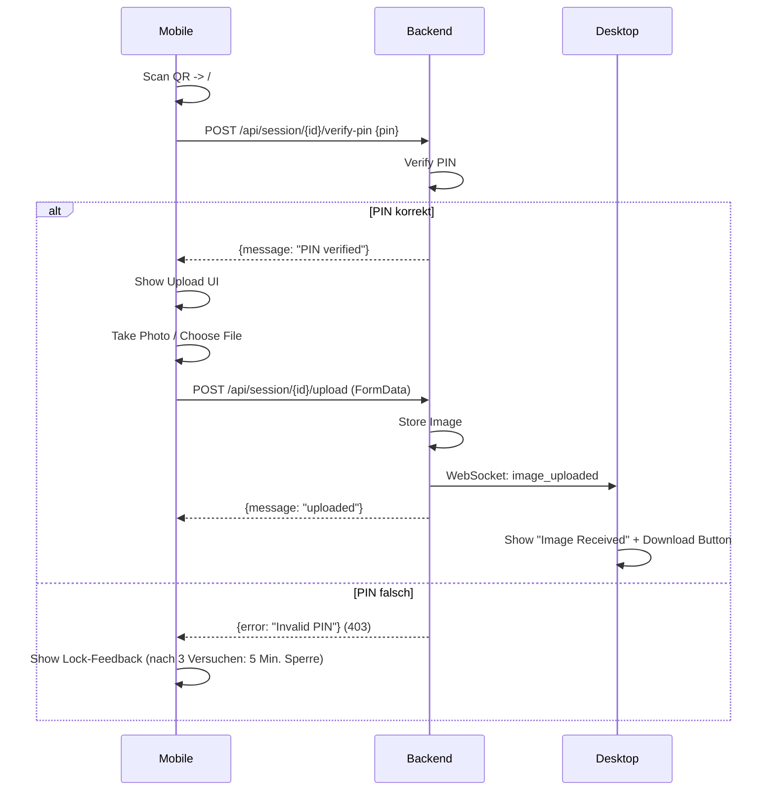
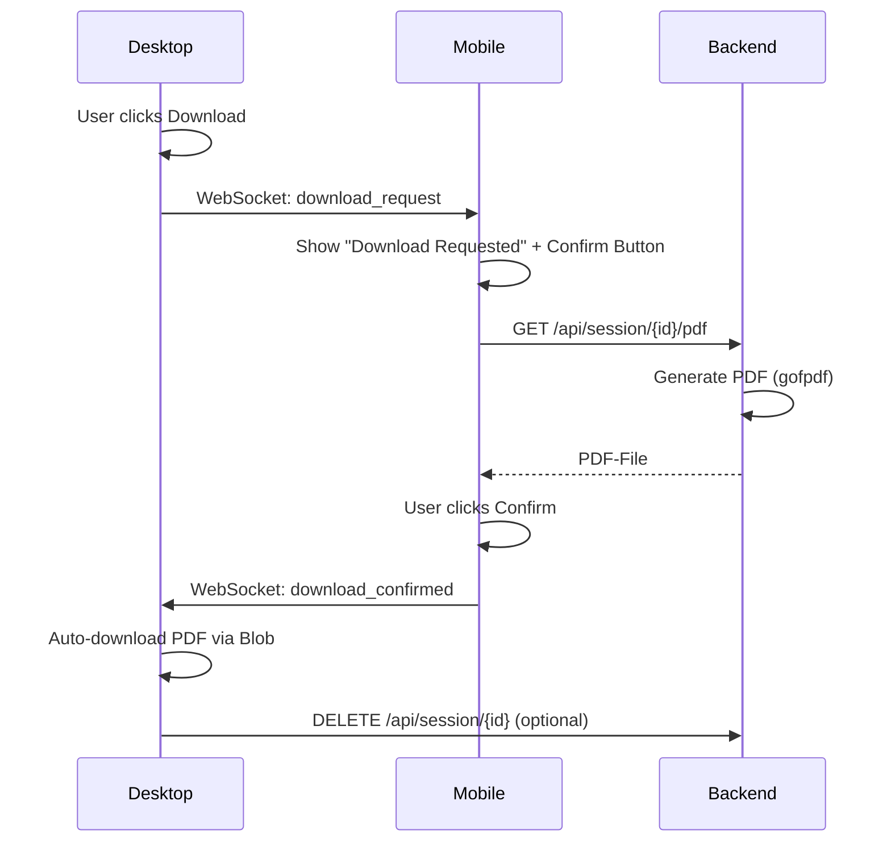
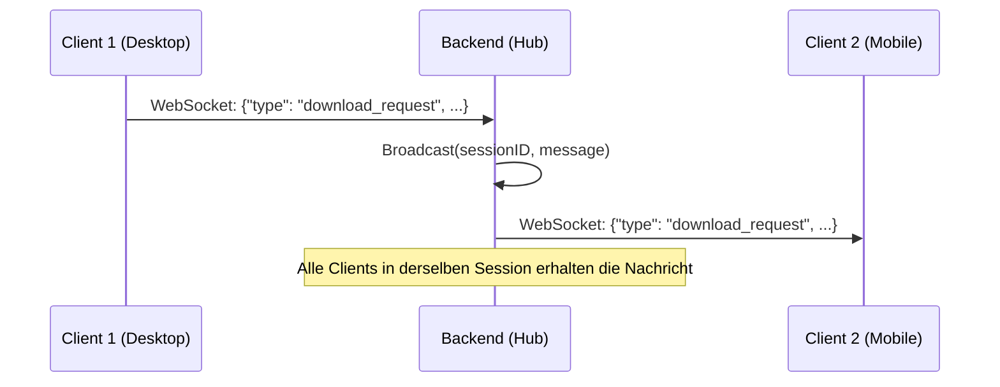
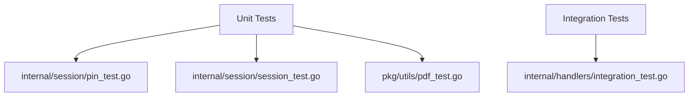

# Dokumentenscanner – Projekt-Dokumentation

*Zentrale Dokumentation für Architektur, Entwicklung und Betrieb. Aktualisiert: 2026-07-25*

---

## Inhaltsverzeichnis

1. [Überblick](#1-überblick)
2. [Architektur](#2-architektur)
3. [Technische Spezifikation](#3-technische-spezifikation)
4. [Konfigurationsmanagement](#4-konfigurationsmanagement)
5. [API-Referenz](#5-api-referenz)
6. [Datenfluss](#6-datenfluss)
7. [Entwicklung](#7-entwicklung)
8. [Deployment](#8-deployment)
9. [Testing](#9-testing)
10. [Bekannte Bugs & Roadmap](#10-bekannte-bugs--roadmap)
11. [Metriken](#11-metriken)
12. [Anhang](#12-anhang)

---

## 1. Überblick

### Projektbeschreibung
Der **Dokumentenscanner** ist eine Web-Anwendung, die den Workflow für das Scannen und Übertragen von Dokumenten zwischen einem **Desktop** (QR-Code-Anzeige) und einem **Mobilgerät** (Kamera + Upload) vereinfacht.

- **Zweck**: Dokumenten-Übertragung ohne direkte Verbindung (z. B. per E-Mail oder Cloud) – ideal für lokale Netzwerke.
- **Zielgruppe**: Nutzer, die schnell Dokumenten-Scans von einem Mobilgerät auf einen Desktop übertragen möchten (z. B. in Meetings oder Homeoffice).

### Kernfeatures
| Feature | Beschreibung |
|---------|--------------|
| **Session-Management** | Temporäre Sessions mit 6-stelliger PIN und 1h Timeout |
| **QR-Code-Generierung** | Automatische Erkennung der LAN-IP für einfache Verbindung |
| **Bild-Upload** | Kamera- oder Datei-Upload mit Client-seitiger Bildbearbeitung (Crop/Rotate) |
| **PDF-Konvertierung** | Server-seitige Generierung eines PDFs aus dem hochgeladenen Bild |
| **Echtzeit-Kommunikation** | WebSocket-basierte Bestätigung zwischen Desktop und Mobile |
| **HTTPS** | Selbstsigniertes TLS-Zertifikat (embedded im Binary) |

---

## 2. Architektur

### Systemarchitektur


### Verzeichnisstruktur
```
NeuDocumentenScaner/
├── backend/
│   ├── cmd/server/
│   │   ├── main.go              # Server-Einstiegspunkt (HTTPS, Graceful Shutdown)
│   │   ├── cert.pem             # Self-signed TLS-Zertifikat (embedded)
│   │   ├── key.pem              # TLS-Private Key (embedded)
│   │   ├── index.html           # Frontend SPA (embedded)
│   │   └── assets/              # Frontend-Build-Assets (embedded)
│   │       ├── index-*.js
│   │       └── index-*.css
│   ├── internal/
│   │   ├── handlers/            # HTTP-Handler
│   │   │   ├── session.go       # CreateSession, VerifyPIN, DeleteSession
│   │   │   ├── qrcode.go        # QR-Code-Generierung (LAN-IP auto-detect)
│   │   │   ├── upload.go        # Bild-Upload + WebSocket-Broadcast
│   │   │   ├── pdf.go           # PDF-Generierung + WebSocket-Broadcast
│   │   │   └── websocket.go     # WebSocket-Handler + Message-Forwarding
│   │   ├── session/             # Session-Management
│   │   │   ├── session.go       # Session-Struktur + Store (In-Memory)
│   │   │   ├── pin.go           # PIN-Generierung + Verifizierung
│   │   │   └── cleanup.go       # Session-Timeout (1h) + Auto-Cleanup
│   │   └── websocket/           # WebSocket-Hub
│   │       └── hub.go           # Client-Management + Broadcast
│   ├── pkg/utils/               # Utility-Funktionen
│   │   ├── pdf.go               # PDF-Generierung (gofpdf)
│   │   └── pdf_test.go          # PDF-Tests
│   ├── go.mod                   # Go-Modul
│   ├── go.sum                   # Abhängigkeiten
│   └── Makefile                 # Build-Skripts (siehe [Entwicklung](#7-entwicklung))
├── frontend/
│   └── dokumentenscanner/
│       ├── index.html           # Laedt Inter-Font (Google Fonts)
│       ├── src/
│       │   ├── views/
│       │   │   ├── DesktopView.vue    # QR-Anzeige + Download-Button
│       │   │   └── MobileView.vue     # PIN-Eingabe + Upload + Bestätigung
│       │   ├── components/
│       │   │   ├── QRCodeDisplay.vue  # QR-Code + PIN-Anzeige
│       │   │   ├── PINInput.vue       # 6-stellige PIN-Eingabe mit Lock-Feedback
│       │   │   └── ImageUpload.vue    # Kamera + Crop + Rotate (Client-seitig)
│       │   ├── stores/
│       │   │   └── sessionStore.ts    # Pinia State (Session-ID, Status, Bild)
│       │   ├── utils/
│       │   │   ├── api.ts             # Axios-Client für REST-API
│       │   │   └── websocket.ts       # WebSocket-Client (Message-Handling)
│       │   ├── router/
│       │   │   └── index.ts           # Hash-Routing (Desktop/Mobile)
│       │   ├── assets/
│       │   │   └── main.css           # CSS Custom Properties (Glassmorphism)
│       │   ├── App.vue
│       │   └── main.ts
│       └── vite.config.ts
└── map.md                        # Diese Datei
```

### Abhängigkeitsgraph (Go-Pakete)


---

## 3. Technische Spezifikation

### Backend

#### Framework & Bibliotheken
| Komponente | Technologie | Version | Zweck |
|------------|-------------|---------|-------|
| Web-Framework | Gin | v1.12.0 | HTTP-Routing |
| WebSocket | gorilla/websocket | v1.5.3 | Echtzeit-Kommunikation |
| PDF-Generierung | go-pdf/fpdf | v0.9.0 | PDF-Erstellung aus Bildern |
| QR-Code | skip2/go-qrcode | – | QR-Code-Generierung |
| UUID | google/uuid | – | Session-ID-Generierung |
| Logging | log/slog | stdlib | Strukturiertes Logging |
| TLS | crypto/tls | stdlib | HTTPS mit self-signed Cert |

#### Session-Datenstruktur
```go
type Session struct {
    ID             uuid.UUID
    PIN            string  // 6-stellig, crypto/rand
    Image          []byte  // Hochgeladenes Bild (JPEG/PNG, < 10MB)
    PDF            []byte  // Generiertes PDF
    Status         SessionStatus
    CreatedAt      time.Time
    ExpiresAt      time.Time // 1h nach Erstellung
    FailedAttempts int      // Max. 3 -> 5 Min. Lock
    LockedUntil    time.Time
}

type SessionStatus string

const (
    StatusWaitingForPIN SessionStatus = "waiting_for_pin"
    StatusUploadAllowed SessionStatus = "upload_allowed"
    StatusUploaded      SessionStatus = "uploaded"
    StatusReady         SessionStatus = "ready"
    StatusDownloaded    SessionStatus = "downloaded"
)
```

- **Speicher**: `map[uuid.UUID]*Session` mit `sync.Mutex` für Thread-Safety (In-Memory).
- **Lebenszyklus**:
  `Erstellung` -> `PIN-Verifizierung` -> `Upload` -> `PDF-Generierung` -> `Download` -> `Automatisches Löschen` (nach 1h oder Download).

#### Sicherheitskonzept
| Massnahme | Implementierung |
|----------|-----------------|
| **PIN-Sicherheit** | 3 Fehlversuche -> 5 Minuten Sperre **pro Session** |
| **Session-Timeout** | 1 Stunde Inaktivitaet **oder** nach PDF-Download |
| **HTTPS** | Selbstsigniertes Zertifikat (im Binary eingebettet) |
| **WebSocket-Auth** | Session-ID im URL-Path (`/ws/session/{id}`) |
| **Bildgroesse** | Max. 10MB pro Upload |

### Frontend

#### Framework & Bibliotheken
| Komponente | Technologie | Version | Zweck |
|------------|-------------|---------|-------|
| Framework | Vue 3 | – | Reaktives UI |
| Build-Tool | Vite | – | Modulares Bundling |
| State-Management | Pinia | – | Zentraler State (Session, Bild) |
| Routing | vue-router | – | Hash-Mode (Desktop/Mobile) |
| HTTP-Client | Axios | – | REST-API-Aufrufe |
| Styling | CSS Custom Properties | – | Glassmorphism-Design |
| Schriftart | Inter | – | Google Fonts |

#### Bildverarbeitung (Client-seitig)
- **APIs**: `ImageBitmap`, `createImageBitmap` (für EXIF-Orientierung)
- **Funktionen**: Kamera-Zugriff, Crop, Rotate

---

## 4. Konfigurationsmanagement

### Architektur

Das Konfigurationssystem nutzt **Viper** mit folgender Prioritätsreihenfolge:



### Config-Struktur

```mermaid
graph TD
    root[Config] --> server[Server]
    root --> session[Session]
    root --> upload[Upload]
    root --> websocket[WebSocket]
    root --> logging[Logging]
    
    server --> port[Port: string]
    server --> host[Host: string]
    server --> tls_cert_path[TLSCertPath: string]
    server --> tls_key_path[TLSKeyPath: string]
    
    session --> timeout[Timeout: duration]
    session --> cleanup_interval[CleanupInterval: duration]
    session --> max_failed_attempts[MaxFailedAttempts: int]
    session --> lockout_duration[LockoutDuration: duration]
    
    upload --> max_file_size_mb[MaxFileSizeMB: int]
    upload --> allowed_types[AllowedTypes: []string]
    
    websocket --> read_deadline[ReadDeadline: duration]
    websocket --> ping_interval[PingInterval: duration]
    websocket --> allowed_origins[AllowedOrigins: []string]
    websocket --> allow_private_ips[AllowPrivateIPs: bool]
    
    logging --> level[Level: string]
    logging --> format[Format: string]
```

### Config-Ladevorgang



### Config-Dateien

| Datei | Umgebungszweck | Besonderheiten |
|-------|---------------|---------------|
| `backend/config/config.yaml` | Standard | Default-Werte für alle Umgebungen |
| `backend/config/config.dev.yaml` | Entwicklung | Debug-Logging, 24h Session-Timeout, 50MB Upload |
| `backend/config/config.prod.yaml` | Produktion | Port 443, TLS-Zertifikate, private IPs gesperrt |

### Docker-Konfiguration

Siehe [Deployment](#8-deployment) für Docker-spezifische Einstellungen.

---

## 5. API-Referenz

### Basis-URL
- **Lokal**: `https://<LAN-IP>:8082` (HTTPS mit self-signed Cert)
- **Beispiel**: `https://192.168.1.100:8082`

### Endpunkte

#### Session-Management
| Methode | Endpunkt | Beschreibung | Request-Body | Response-Body | Status |
|---------|----------|--------------|--------------|----------------|--------|
| POST | `/api/session` | Session erstellen | – | `{"session_id": "uuid", "pin": "123456"}` | 201 |
| DELETE | `/api/session/{id}` | Session loeschen | – | – | 204 |

#### QR-Code & PIN
| Methode | Endpunkt | Beschreibung | Request-Body | Response-Body | Status |
|---------|----------|--------------|--------------|----------------|--------|
| GET | `/api/session/{id}/qrcode` | QR-Code als PNG (enthaelt `session_id` und LAN-IP) | – | PNG-Binary | 200 |
| POST | `/api/session/{id}/verify-pin` | PIN pruefen | `{"pin": "123456"}` | `{"message": "PIN verified"}` | 200 / 403 |

#### Bild-Upload & PDF
| Methode | Endpunkt | Beschreibung | Request-Body | Response-Body | Status |
|---------|----------|--------------|--------------|----------------|--------|
| POST | `/api/session/{id}/upload` | Bild hochladen (JPEG/PNG, < 10MB) | `multipart/form-data` (Field: `image`) | `{"message": "uploaded"}` | 200 / 400 |
| GET | `/api/session/{id}/pdf` | PDF herunterladen | – | PDF-Binary | 200 / 404 |

#### WebSocket
| Methode | Endpunkt | Beschreibung | Nachrichtenformat | Status |
|---------|----------|--------------|-------------------|--------|
| GET | `/ws/session/{id}` | WebSocket-Verbindung fuer Echtzeit-Kommunikation | JSON (siehe unten) | 101 |

**WebSocket-Nachrichten**:
```json
// Server -> Clients (Broadcast)
{"type": "image_uploaded", "session_id": "uuid"}
{"type": "download_request", "session_id": "uuid"}
{"type": "download_confirmed", "session_id": "uuid"}

// Clients -> Server
{"type": "download_request", "session_id": "uuid"}
{"type": "download_confirmed", "session_id": "uuid"}
```

---

## 6. Datenfluss

### 1. Session-Erstellung + QR-Code


### 2. Mobile: PIN + Upload


### 3. Download-Bestaetigung via Mobile


### 4. WebSocket Message-Forwarding


---

## 7. Entwicklung

### Voraussetzungen
| Tool | Version | Zweck |
|------|---------|-------|
| Go | >= 1.21 | Backend (fuer `log/slog`) |
| Node.js | >= 18 | Frontend (Vue 3 + Vite) |
| npm | >= 9 | Frontend-Dependencies |
| Git | – | Versionskontrolle |

### Projekt-Setup
```bash
# Backend-Dependencies
cd backend
make deps          # Go-Module herunterladen

# Frontend-Dependencies
cd ../frontend/dokumentenscanner
npm install        # Vue/Pinia/Axios/etc.
```

### Build & Run
| Befehl | Beschreibung |
|--------|--------------|
| `make deps` | Go-Module installieren |
| `make lint` | Code-Formatierung pruefen (`go vet` + `gofmt`) |
| `make fmt` | Code automatisch formatieren |
| `make test` | Unit-Tests ausfuehren |
| `make coverage` | Test-Coverage generieren (HTML-Report) |
| `make build` | Backend-Binary erstellen (`./server`) |
| `make run` | Backend starten (HTTPS auf Port 8082) |
| `make frontend-build` | Frontend bauen + nach `cmd/server/` kopieren |
| `make all` | `lint` -> `test` -> `build` |
| `make clean` | Temp-Files, Logs, Binaries bereinigen |

**Manueller Start (ohne Makefile)**:
```bash
# Backend
cd backend
go run ./cmd/server

# Frontend (Dev-Mode mit Hot-Reload)
cd ../frontend/dokumentenscanner
npm run dev
```

### Strukturiertes Logging
- **Bibliothek**: `log/slog` (stdlib, ab Go 1.21)
- **Format**: JSON (maschinenlesbar)
- **Ausgabe**: stdout/stderr (12-Factor-Prinzip, kein File-Logging)

**Log-Levels**:
| Level | Verwendung | Beispiel |
|-------|------------|----------|
| `DEBUG` | WebSocket-Nachrichten, Detail-Infos | `{"level":"DEBUG","msg":"WebSocket message","session_id":"abc-123"}` |
| `INFO` | Server-Start, Session-Erstellung, Upload | `{"level":"INFO","msg":"Session created","session_id":"abc-123"}` |
| `WARN` | Fehlgeschlagene PIN-Versuche, Session-Timeout | `{"level":"WARN","msg":"Invalid PIN attempt","session_id":"abc-123","attempt":2}` |
| `ERROR` | WebSocket-Fehler, PDF-Generierung fehlgeschlagen | `{"level":"ERROR","msg":"PDF generation failed","error":"..."}` |

**Geplante Integration** (siehe [Roadmap](#10-bekannte-bugs--roadmap)):
- `cmd/server/main.go`: `slog.Info` fuer Start/Stop
- `handlers/*`: `slog.Info` fuer Requests, `slog.Warn` fuer PIN-Fehler
- `websocket/*`: `slog.Debug` fuer Nachrichten, `slog.Error` fuer Fehler

---

## 8. Deployment

### Lokal (Standard)
- **Port**: 8082 (konfigurierbar in `cmd/server/main.go`)
- **HTTPS**: Selbstsigniertes Zertifikat (automatisch generiert bei erstem Start)
- **Start**:
  ```bash
  cd backend
  make run
  ```
- **Zugriff**: `https://localhost:8082` oder `https://<LAN-IP>:8082`

### Reverse-Proxy (optional)
**Beispiel fuer Caddy** (`Caddyfile`):
```
dokumentenscanner.localhost {
    reverse_proxy localhost:8082
}
```
**Beispiel fuer Nginx**:
```nginx
server {
    listen 443 ssl;
    server_name dokumentenscanner.localhost;
    ssl_certificate /path/to/cert.pem;
    ssl_certificate_key /path/to/key.pem;
    location / {
        proxy_pass https://localhost:8082;
        proxy_set_header Host $host;
        proxy_set_header X-Real-IP $remote_addr;
    }
}
```

### Umgebungsvariablen (geplant)
| Variable | Standardwert | Beschreibung |
|----------|--------------|--------------|
| `PORT` | `8082` | Server-Port |
| `SESSION_TIMEOUT` | `1h` | Session-Lebensdauer |
| `MAX_FAILED_ATTEMPTS` | `3` | PIN-Fehlversuche vor Sperre |
| `LOCKOUT_DURATION` | `5m` | Sperrdauer nach zu vielen Fehlversuchen |

---

## 9. Testing

### Teststruktur


### Test-Coverage
| Metrik | Wert |
|--------|------|
| Unit-Tests | 11 |
| Integration-Tests | 1 |
| **Gesamt-Coverage** | ~85% (geplant) |

**Coverage-Report generieren**:
```bash
make coverage
# Oeffnet coverage.html im Browser
```

### Test-Fokus
- **Unit-Tests**: Session-Management (PIN-Generierung, Verifizierung, Timeout)
- **Integration-Tests**: Kompletter Workflow (Session -> Upload -> PDF -> Download)
- **Manuelle Tests**: WebSocket-Kommunikation, Mobile/Desktop-Interaktion

---

## 10. Bekannte Bugs ## 9. Bekannte Bugs & Roadmap Roadmap


### Status der Bugfixes

**Aktualisierung 2026-07-25**: Alle zuvor dokumentierten Bugs wurden behoben ✅

| Bug | Status | Lösung |
|-----|--------|---------|
| Cleanup-Goroutine Leak | ✅ | Session-Store Cleanup in main.go |
| Mutex-Deadlock | ✅ | Redesign der Handler-Dependencies |
| WebSocket Timeouts | ✅ | Config-basierte Timeouts + Ping/Pong |

### Abgeschlossene Phase 3 Aufgaben

| Aufgabe | Beschreibung | Status |
|---------|--------------|--------|
| 3.0 Config-Package | Zentrales Konfigurationsmanagement | ✅ |
| 3.1 Config in main.go | Integration der Config | ✅ |
| 3.2 Handler-Deps | Dependency Injection | ✅ |
| 3.3 Upload-Validierung | Config-basierte Validierung | ✅ |
| 3.4 Origin-Check | Konfigurierbare Origin-Validierung | ✅ |
| 3.5 Config-Dateien | Dev/Prod Config-Templates | ✅ |
| 3.6 Makefile Config | Docker-Build-Ziele | ✅ |
| 3.7 Config-Tests | Unit-Tests für Config | ✅ |
| 3.8 Docker | Containerisierung | ✅ |

### Nächste Meilensteine (Phase 4)
| Aufgabe | Beschreibung | Priorität |
|---------|--------------|-----------|
| 4.1 Graceful Shutdown | Sauberes Beenden mit Signal-Handling | Mittel |
| 4.2 Strukturiertes Logging | Vollständige slog-Integration | Mittel |
| 4.3 Makefile finalisieren | Komplette Build-Infrastruktur | Niedrig |

---

*Letzte Aktualisierung: 2026-07-25. Für den detaillierten Projektplan siehe [plan.md](plan.md).*
